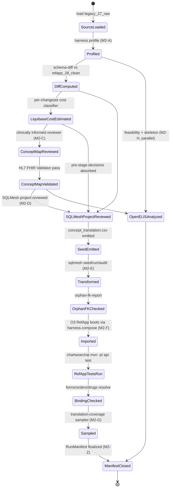

# Phase 1 — Data Model

**Feature**: 002-openmrs-demo-data-2-8-remap
**Date**: 2026-05-13

This document enumerates the artifacts produced and consumed by the feature. It anchors on the M0 control-plane primitives (PR #2, merged to main via PR #3) plus the M0 follow-up (PR #4, in review) which pins `targets/catalyst` and aligns `compose/openmrs-2.8-refapp.yml` with the O3 RefApp stack.

## 0. Anchored on M0 / PR #4

The following primitives are **not redefined here** — they are consumed as-is:

| M0 primitive | Path | What 002 uses it for |
|---|---|---|
| Target registry | `harness/targets.yaml` | Reads `targets.chartsearchai.validation_surface.command` for M2-F cross-target validation; reads `shared_infrastructure.openmrs_refapp` for bringup. |
| Submodule pins | `.gitmodules`, `targets/<id>/` | `targets/chartsearchai`, `targets/querystore` (pinned by M0); `targets/catalyst` (pinned by PR #4) reference points. |
| Shared compose | `compose/openmrs-2.8-refapp.yml` (post-PR #4 = O3 stack on Core 2.8.x + MariaDB 10.11.7) | M2-F real-bringup; M2-A clean-baseline snapshot. |
| Run manifest | `harness.metadata.RunManifest` | Base manifest record. 002 adds top-level fields; see `contracts/run_manifest_002_extensions.schema.yaml`. |
| Events log | `harness.metadata.append_event` | All 002 events route through this writer. |
| Compose lifecycle | `harness.compose.compose_files_for_profile` | Plan compose ups/downs for M2-F. |
| Targets loader | `harness.targets.load_target_registry` | Load `harness/targets.yaml`; classify `evidence_status`. |

## 1. Source corpus

- **Path**: `data/large-demo-data-2-7-0.sql`
- **Format**: MySQL/MariaDB dump (CREATE TABLE + INSERT statements; 143 tables, 153 insert batches)
- **Provenance**: public, cleaned, anonymized OpenMRS demo dataset (FR-PHI1, FR-PHI2)
- **Pinned by**: `datasets/sources/large-demo-data-2-7-0.sql.checksum` (SHA-256 digest + origin URL + license + retrieval timestamp)
- **Lifecycle**: read-only; loaded once per run into MariaDB schema `legacy_27_raw`

## 2. Clean target baseline

- **Schema**: `refapp_28_clean` (MariaDB 10.11)
- **Built by**: launching the O3 backend container (`openmrs/openmrs-reference-application-3-backend:3.6.0`) against an empty MariaDB and letting it complete Liquibase bootstrap (Core 2.8.x changesets). Then exporting the schema (no data rows) for diff comparison.
- **Lifecycle**: rebuilt at the start of every run. Schema export captured under `artifacts/<run>/schema-diff/refapp_28_clean.schema.json`.

## 3. Pinned OCL snapshots

- **Path**: `datasets/sources/ocl/<collection>/<version>/`
- **Collections**: at minimum CIEL (terminology authority) and LOINC (OpenMRS↔OpenELIS bridge); SNOMED CT optional if the corpus requires it.
- **Provenance**: each snapshot directory carries a `provenance.json` recording OCL collection URL, version identifier, retrieval timestamp, checksum.
- **Lifecycle**: refreshed deliberately (out-of-band) as a PCCP-triggering action; read-only during transform.

## 4. Profile inventory

- **Path**: `artifacts/<run>/profile/inventory.json`
- **Contract**: [`contracts/profile_inventory.schema.yaml`](./contracts/profile_inventory.schema.yaml)
- **Fields**:
  - per-table: name, row count, populated columns, PK ranges, FK references in/out
  - concept reference sources (every row in `concept_reference_source` + the `concept_reference_map` row count per source)
  - locales (union of locales referenced by `concept_name`, `concept_description`, `global_property.allowed.locale.list`)
  - modules: every table classified by inferred owning module
- **FR coverage**: FR-001..FR-005

## 5. Schema/metadata diff + Liquibase cost estimate

- **Paths**:
  - `artifacts/<run>/schema-diff/diff.json` (contract: `contracts/schema_diff.schema.yaml`)
  - `artifacts/<run>/profile/liquibase-cost-estimate.json` (contract: `contracts/liquibase_cost.schema.yaml`)
- **Diff fields**: tables-only-in-source, tables-only-in-target, columns added/removed/retyped, index/constraint differences, module-owned classifications, Liquibase changeset deltas; each item carries `clinical_meaningful: boolean` (per research.md §R5).
- **Liquibase cost fields**: per-changeset (changeSetId, file, type, estimated cost class — `instant` / `seconds` / `minutes` / `hours`) based on corpus row counts and known OpenMRS-Talk-documented expensive-changeset patterns (research.md §R-Liquibase). Feeds M2-D's pre-stage decisions.
- **FR coverage**: FR-004, FR-005, FR-008 (covering-gate input)

## 6. Accepted terminology mapping (FHIR ConceptMap)

- **Path**: `datasets/mappings/openmrs-2.7-to-2.8.conceptmap.json`
- **Format**: FHIR R4 ConceptMap (validated by HL7 FHIR Validator CLI)
- **Profile**: [`contracts/conceptmap.profile.md`](./contracts/conceptmap.profile.md)
- **Per-element-target required fields**:
  - `code` (target seeded-dictionary concept_id or UUID)
  - `equivalence` (`equivalent` / `equal` / `wider` / `narrower` / `inexact` / `unmatched` / `disjoint`)
  - `comment` (reviewer rationale; non-empty)
  - Extension `http://harness.local/StructureDefinition/policy-bucket`: `remap` / `seed-augment` / `drop`
  - Extension `http://harness.local/StructureDefinition/source-record-examples` (array of up to 3 source record IDs)
- **Companion review document**: `datasets/mappings/openmrs-2.7-to-2.8.conceptmap.review.md`
- **FR coverage**: US3 (P1), FR-CD1..CD4, FR-007, FR-027, SC-012, SC-014

## 7. Accepted structural mapping (SQLMesh project)

- **Path**: `datasets/transforms/sqlmesh/`
- **Profile**: [`contracts/sqlmesh_project.profile.md`](./contracts/sqlmesh_project.profile.md)
- **Per-model required `name:` / metadata fields** (in the model's `MODEL (...)` block or sidecar YAML):
  - `description` — reviewer-readable rationale
  - `tags` including a `policy_bucket:` entry (`remap` / `drop` / `install-module` / `orphan-carry-forward` / `passthrough`)
  - `audits:` — at least `unique_values()` on PK and `not_null()` on FK columns; custom audits where applicable
  - Cross-reference to `diff_items_covered[]` (from `schema_diff.json`) in the model's description
- **Seeds**:
  - `seeds/concept_translation.csv` — emitted by `harness.conceptmap.seed_emit` from the accepted ConceptMap; columns `(source_concept_id, source_uuid, target_concept_id, target_uuid, equivalence, policy_bucket, source_record_examples)`. Regenerable; checksum tracked in run manifest.
  - `seeds/module_table_policy.csv` — reviewed mapping of every module-owned table to `orphan-carry-forward` / `drop` / `install-module` / `remap-into-<table>` plus rationale.
- **FR coverage**: US1 (P1), FR-008..FR-013, FR-CD5, FR-025, FR-026

## 8. Transform output (candidate DB)

- **Paths**:
  - MariaDB schema `refapp_28_demo` (live)
  - Dump: `artifacts/<run>/transform/refapp_28_demo.sql`
  - Per-row audit: `artifacts/<run>/transform/row_audit.parquet` (or `.jsonl`) — one record per transformed row with `(source_table, source_pk, target_table, target_pk, policy_bucket, equivalence_label, reviewer_rationale_ref)`
  - Orphan-FK report: `artifacts/<run>/transform/orphan-fk-report.json`
- **FR coverage**: FR-009..FR-013

## 9. Import smoke + RefApp tests + binding report

- **Paths**:
  - `artifacts/<run>/import-smoke/report.json` — Liquibase startup, Compose health, REST/FHIR readback for canonical endpoints
  - `artifacts/<run>/refapp-binding/report.json` — bundled-form rendering, default order types, drug catalog resolution against translated concepts
  - `artifacts/<run>/chartsearchai-tests/results.xml` — surefire XML from invoking `harness/targets.yaml.targets.chartsearchai.validation_surface.command` (`mvn -pl api test`) inside `targets/chartsearchai/` with the translated demo DB connection
- **Per check captured**: check_id, target endpoint, inputs, pass/fail, evidence (response excerpt or test output), elapsed_ms
- **FR coverage**: FR-014, FR-CD5, SC-002 (binding), SC-013

## 10. Translation-coverage sampler output

- **Path**: `artifacts/<run>/coverage/sample-<seed>.json`
- **Contract**: [`contracts/coverage_sample.schema.yaml`](./contracts/coverage_sample.schema.yaml)
- **Fields**: sampler seed, ConceptMap version + checksum, per-policy-bucket samples (default N per bucket = 5, configurable), per-record evidence (`source_record_id`, `target_record_id`, `translated_concept_id`, `equivalence_label`, `value`, `units`, `date`, `encounter_id`, `provider_id`, REST/FHIR response excerpt, pass/fail).
- **FR coverage**: FR-015, FR-024, SC-002, SC-010

## 11. OpenELIS feasibility report + mapping skeleton

- **Paths**:
  - `artifacts/<run>/openelis/feasibility.md` — human-readable per-entity analysis
  - `artifacts/<run>/openelis/feasibility.json` — machine-readable counterpart ([`contracts/openelis_feasibility.schema.yaml`](./contracts/openelis_feasibility.schema.yaml))
  - `datasets/mappings/openmrs-2.7-to-openelis.skeleton.conceptmap.json` — terminology skeleton (FHIR ConceptMap, OpenMRS source → LOINC primarily, SNOMED secondarily)
  - `datasets/mappings/openmrs-2.7-to-openelis.skeleton.yaml` — structural skeleton ([`contracts/openelis_skeleton.profile.md`](./contracts/openelis_skeleton.profile.md))
- **Per OpenELIS entity** (patient, provider, organization/location, test/analyte, order, result/observation, specimen, reference terminology):
  - `feasibility`: `full` / `partial` / `synthesized` / `not-feasible`
  - `source_columns`: array of `<table>.<column>` strings
  - `rationale`: reviewer-written prose
  - `shared_identifier_proposal`: how OpenMRS patients would match OpenELIS patients
  - `terminology_translation_required`: boolean + notes
  - `loinc_bridge_coverage`: % of clinical references that have a LOINC mapping via CIEL (lab entities only)
- **Source for OE Global schema**: the sibling checkout at `/Users/pmanko/code/OpenELIS-Global-2/` (read-only; not a submodule of this harness)
- **No Catalyst code is executed**: the `targets/catalyst` submodule (PR #4) is referenced as the documented umbrella entry point for future loader work
- **FR coverage**: US4, FR-017..FR-020, SC-007, SC-008

## 12. Run manifest

- **Path**: `artifacts/<run>/run_manifest.json`
- **Authoring**: via `harness.metadata.RunManifest(...).to_dict()` (M0). 002 adds top-level fields as schema-compatible additions, enumerated in [`contracts/run_manifest_002_extensions.schema.yaml`](./contracts/run_manifest_002_extensions.schema.yaml). 002 does NOT define a new manifest schema.
- **M0-required fields populated by 002**:
  - `run_id`, `project=clinical-ai-validation-harness`, `component=002-openmrs-demo-data-2-8-remap`
  - `git_sha` (harness repo HEAD)
  - `dataset_id=openmrs-large-demo-2-7-0`, `dataset_version=<source_dump_sha256>`, `schema_mapping_version=<conceptmap_checksum>:<sqlmesh_project_checksum>`
  - `generated_at`, `evidence_status` (per stage; `development` or `scaffolding` for OpenELIS portion)
  - `decision_rationale` (when not `release`, required per M0 schema)
  - `target_provenance[]` for each consumed target (chartsearchai, querystore if used, catalyst as scaffolding-only): `target_id`, `target_source=reviewed_submodule`, `target_path`, `target_actual_sha` (from `git submodule status`), `target_reviewed_sha`, `target_override=false`, `evidence_status`
  - `otel.semconv_status=development`, `otel.semconv_stability_opt_in=gen_ai_latest_experimental`, `otel.gen_ai.provider.name` (N/A here — no LLM at runtime; the field is omitted with `decision_rationale` noting model_or_agent_involved == false)
- **002 extensions** (additional top-level fields):
  - `conceptmap_path`, `conceptmap_checksum`
  - `sqlmesh_project_path`, `sqlmesh_project_checksum`
  - `concept_translation_seed_checksum`, `module_table_policy_seed_checksum`
  - `ocl_collection_versions[]` (array of `{collection, version, snapshot_path, checksum}`)
  - `openmrs_refapp_image_digest` (the `openmrs-reference-application-3-backend:3.6.0` digest pulled at run time)
  - `mariadb_image_digest` (the `mariadb:10.11.7` digest)
  - `fhir_validator_version`, `sqlmesh_version`, `python_version`
  - `policy_buckets[]` (enumerated from the ConceptMap)
  - `reviewer_signoffs[]` (paths to ConceptMap review doc + SQLMesh project review doc + signer identity + signoff date + per-doc checksum)
- **FR coverage**: FR-021, SC-006, SC-009

## 13. Events log

- **Path**: `artifacts/<run>/events.jsonl`
- **Authoring**: via `harness.metadata.append_event` (M0)
- **002 event types** (one JSONL line each): `profile_start`, `profile_table`, `profile_complete`, `diff_start`, `diff_item`, `diff_complete`, `liquibase_cost_estimated`, `conceptmap_loaded`, `conceptmap_validated`, `sqlmesh_seed`, `sqlmesh_run_model`, `sqlmesh_audit`, `orphan_fk_detected`, `compose_up`, `compose_down`, `import_smoke_check`, `binding_check`, `chartsearchai_test_invoked`, `sample_drawn`, `openelis_classification`, `pccp_record_emitted`, `run_complete`
- **Fields per event**: `event_id`, `event_type`, `timestamp` (auto-set by `append_event`), `run_id`, type-specific payload, optional `decision_rationale` for events carrying a reviewer decision
- **FR coverage**: FR-021, SC-009

## 14. PCCP change records

- **Path**: `specs/002-openmrs-demo-data-2-8-remap/pccp/<YYYYMMDD>-<topic>.md`
- **Template**: existing `specs/artifacts/planning/pccp-change-record-template.md`
- **Triggered by**: material changes to ConceptMap, SQLMesh project, module_table_policy, target version pins (image digests), OCL pinned snapshot versions, OpenELIS feasibility classifications

---

## Lifecycle / state transitions

## Validation rules (cross-artifact)

- Every source concept_id referenced by ≥1 row in `obs`, `conditions`, `diagnosis`, `allergy`, `drug_order`, `encounter_diagnosis`, `concept_set` MUST appear in `concept_translation.csv` with a policy_bucket. Verified by `harness/conceptmap/validate.py` (cross-checks `profile/inventory.json` against the ConceptMap).
- Every diff item with `clinical_meaningful: true` MUST be referenced in at least one SQLMesh model's `description` / `diff_items_covered`. Verified by `harness/transform/run.py` pre-flight.
- Every PCCP change record MUST cite ≥1 before/after record example. Verified by `tests/test_pccp_records.py`.
- `run_manifest.json` MUST validate against `specs/001-harness-control-plane-foundation/contracts/run-manifest-control-plane.schema.yaml` (M0 base) AND `specs/002-openmrs-demo-data-2-8-remap/contracts/run_manifest_002_extensions.schema.yaml` (002 extensions). Verified at run-end and by CI.
- `harness/targets.yaml.targets.chartsearchai.validation_surface.command` MUST be the M2-F cross-target validation invocation; M2-F MUST NOT re-implement chartsearchai test logic.
