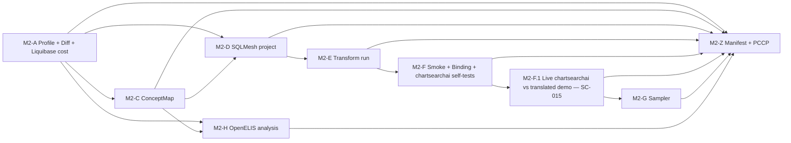

# Implementation Plan: OpenMRS Demo Data Remap, Import, and OpenELIS Cross-Load Analysis

**Branch**: `002-openmrs-demo-data-2-8-remap` | **Date**: 2026-05-13 | **Spec**: [spec.md](./spec.md)

**Input**: Feature specification from `/specs/002-openmrs-demo-data-2-8-remap/spec.md`

## Summary

Transform the publicly published `data/large-demo-data-2-7-0.sql` (OpenMRS 2.7.0 demo dump) into an OpenMRS **Core/Platform 2.8.x + Reference Application 3.x (O3)** compatible importable database — deterministically and from a clean baseline — with **terminology translation onto a CIEL concept dictionary loaded into the clean baseline as the central first-class deliverable** (records remap onto that CIEL dictionary using FHIR ConceptMap equivalence labels, with CIEL via OCL as the terminology authority and LOINC as the bridge for OpenELIS analysis). The same source corpus is analyzed for OpenELIS Global cross-load feasibility — analysis and machine-readable mapping skeleton only; no live OpenELIS load runs in this milestone.

> **Note on terminology baseline**: The O3 RefApp distro **bundles `openmrs-module-openconceptlab` (the loader) but does not pre-populate the concept dictionary**. The "loaded CIEL baseline" referenced above is constructed explicitly by M2-A using the module's offline-import against a pinned CIEL export under `datasets/sources/ocl/CIEL/<version>/`. See `research.md` §R-Terminology-Stack for the corrected understanding.

This feature consumes the M0 control plane (PR #2 / merged to main via PR #3) and the M0 follow-up (PR #4, in review) which pins the `targets/catalyst` submodule and updates `compose/openmrs-2.8-refapp.yml` to the O3 stack.

**Technical approach** (per Phase 0 research; decisions made in this session):

- **Terminology stack** (corrected baseline): **CIEL via OCL (Open Concept Lab)** is the OpenMRS-side terminology authority; **LOINC** is the OpenMRS↔OpenELIS bridge; **FHIR R4 ConceptMap** is used purely as the mapping artifact *grammar* (equivalence labels: `equivalent` / `equal` / `wider` / `narrower` / `inexact` / `unmatched`). FHIR is not a terminology authority itself.
- **OCL integration is deterministic**: harness pins a current CIEL collection version (plus LOINC snapshot) into `datasets/sources/ocl/<collection>/<version>/` once per accepted-mapping cycle; the snapshot is checksum-recorded and read-only during transform. No live OCL API calls during `sqlmesh run` / smoke / sampler. Refreshing the pin is a deliberate, PCCP-triggering action.
- **Structural transform engine**: **SQLMesh** (Apache-2.0, Linux Foundation, dbt-project-compatible). Chosen over dbt-core because SC-004 (byte-identical re-runs) is a primary success criterion and SQLMesh's content-fingerprint model versioning + time-filtered query wrappers + virtual environments are engineered around that property. ConceptMap is bridged into SQLMesh via a one-way emitter that produces a `seed_csv` model.
- **Real bringup** = M0's shared compose. `compose/openmrs-2.8-refapp.yml` (after PR #4 lands) brings up the O3 RefApp 3.x stack — `gateway` + `frontend` + `backend` (Core 2.8.x) + `db` (MariaDB 10.11.7) — declared in `harness/targets.yaml` as `shared_infrastructure.openmrs_refapp`. The harness does **not** invent its own bringup; it invokes the M0 compose contract.
- **Module-data policy**: orphan-table carry-forward by default (mirrors real OpenMRS distro upgrade behavior); escalations to drop/install/remap are explicit SQLMesh models with reviewer rationale.
- **Real-path validation against chartsearchai** is split across two milestones for clarity: (a) **M2-F** invokes chartsearchai's M0-declared `validation_surface.command` (`mvn -pl api test` inside `targets/chartsearchai/`) to confirm the module is healthy against its own internal fixtures, plus a thin harness layer for concept-translation-binding assertions against the imported demo; (b) **M2-F.1 — the first real milestone (SC-015)** — brings up the live chartsearchai docker-compose stack (`targets/chartsearchai/docker-compose.yml`, image tag `nightly-chartsearch`) against the translated demo, runs an indexer warmup, posts a clinical question to `/ws/rest/v1/chartsearchai/search`, and verifies citations resolve to translated records. M2-F.1 is what satisfies Constitution Principle I (real chartsearchai production path against our translated data).
- **Translation-coverage sampler**: a deterministic Python module under `harness/` parameterized off the accepted ConceptMap's equivalence labels and policy buckets, drawing record-level evidence on demand from the imported demo via OpenMRS REST/FHIR.
- **OpenELIS analysis**: terminology skeleton (FHIR ConceptMap, LOINC-bridged) + structural skeleton YAML + per-entity feasibility report. Reads OE Global schema from `OpenELIS-Global-2/` (sibling, not a submodule of this harness). Catalyst submodule (`targets/catalyst`) is referenced as the AI-umbrella entry point but no Catalyst code is invoked under this feature.

## Technical Context

**Language/Version**: Python 3.11+ (harness layer; `uv` managed per M0); SQL (SQLMesh models against MariaDB 10.11); FHIR R4 (ConceptMap artifacts); YAML (SQLMesh metadata, `harness/targets.yaml`-conformant).

**Primary Dependencies**:
- `sqlmesh >= 0.150` with MariaDB/MySQL adapter (Apache-2.0; Linux Foundation)
- `fhir.resources >= 7.0` (Python R4 ConceptMap parser/validator; MIT)
- HL7 FHIR Validator CLI (`org.hl7.fhir.validator` JAR) for ConceptMap conformance
- `mariadb-connector-python` or `PyMySQL` (DB introspection; MariaDB-compatible)
- `requests` (OpenMRS REST/FHIR readback)
- `ocldev` or direct OCL REST API client (out-of-band snapshot refresh only; never during transform)
- Docker Compose (existing `compose/openmrs-2.8-refapp.yml` after PR #4 swaps to O3 stack)
- `PyYAML` (already pinned by harness)

Existing M0 primitives reused (NOT reimplemented):
- `harness.targets` — load + validate `harness/targets.yaml`; submodule status; readiness classification
- `harness.submodules` — submodule sync command planning
- `harness.compose` — shared-infra compose lifecycle planning
- `harness.metadata.RunManifest` — manifest record with `target_provenance[]`, `evidence_status`, OTel GenAI fields
- `harness.metadata.append_event` — events.jsonl writer
- `harness.config` — harness root + artifact-root resolution

**Storage**: MariaDB 10.11 (the O3 RefApp's DB engine, per `compose/openmrs-2.8-refapp.yml`). Source dump loaded into disposable `legacy_27_raw` schema; the live `openmrs` schema (CIEL-loaded via the openconceptlab module) IS the clean baseline — no separate empty-Liquibase-only schema is maintained; transformed output written to `refapp_28_demo` and dumped to `artifacts/<run>/transform/refapp_28_demo.sql`.

**Testing**:
- `pytest >= 8.0` (already pinned) for harness modules and integration smoke
- `sqlmesh audit` for SQL-side model assertions (uniqueness, FK integrity, not-null, custom audits)
- `sqlmesh plan` + `sqlmesh run --dry-run` as the project conformance check (SC-011 structural side)
- HL7 FHIR Validator CLI for ConceptMap conformance (SC-011 terminology side)
- **Cross-target chartsearchai validation**: `mvn -pl api test` inside `targets/chartsearchai/` (declared by M0 in `harness/targets.yaml.targets[chartsearchai].validation_surface.command`); harness invokes this via `harness.targets` rather than re-implementing.
- Compose lifecycle planning verified through M0's `harness.compose` tests (no parallel infrastructure introduced).

**Target Platform**: Linux x86_64 container (CI) and macOS/Linux developer workstations. Java 17+ (Validator CLI) + Java 21 (O3 backend) required transitively.

**Project Type**: 002 is the first **feature-level** consumer of the M0 control plane. It writes new artifacts under `datasets/`, `harness/<feature-scoped modules>`, and `specs/002-openmrs-demo-data-2-8-remap/`, but it reuses M0's primitives end-to-end.

**Performance Goals**: From clean baseline to imported, smoke-passing O3 RefApp in **< 60 min wall-time** on a developer workstation (SC-001). Profiling + diff stage < 5 min for fast review loops. Liquibase upgrade-in-place cost is the open risk; addressed in M2-A enumeration.

**Constraints**: Deterministic byte-identical re-runs (SC-004) modulo documented stable normalizations. No bespoke mapping executor; all mapping evaluation routes through SQLMesh + FHIR Validator. No live OCL calls during transform. PHI scrubbing out of scope (FR-PHI1–PHI3). No live OpenELIS bringup (Q1 clarification). Catalyst submodule referenced as umbrella entry but not exercised.

**Scale/Scope**: Single source dump (~143 CREATE TABLE statements, ~153 INSERT batches). Single OpenMRS target version pin (Core 2.8.x via O3 RefApp 3.6.0 in `compose/openmrs-2.8-refapp.yml`). Mapping artifact ~O(10³–10⁴) ConceptMap entries depending on referenced source concepts.

## Constitution Check

*GATE: Must pass before Phase 0 research. Re-checked after Phase 1 design.*

| Gate | Status | Notes |
|---|---|---|
| **Real production paths** | PASS | Real OpenMRS O3 RefApp 3.x (Core 2.8.x) brought up via M0's `compose/openmrs-2.8-refapp.yml` (post-PR-#4); import smoke, Ref App binding, translation-coverage sampler query the live stack via REST/FHIR. SQLMesh executes against the real MariaDB 10.11 instance. chartsearchai validation invoked via M0's declared `validation_surface.command` (`mvn -pl api test` in `targets/chartsearchai/`). FHIR Validator is unmodified release. OpenELIS analysis-only (Q1) labelled `evidence_status: scaffolding` (Catalyst submodule is umbrella-only; no Catalyst path exercised). |
| **Deterministic reviewed transforms** | PASS | Accepted mappings live in two reviewed artifacts: `datasets/mappings/openmrs-2.7-to-2.8.conceptmap.json` (FHIR ConceptMap) and `datasets/transforms/sqlmesh/` (SQLMesh project). LLM proposals labelled `artifacts/advisory/` and excluded from `sqlmesh run`. SQLMesh's content-fingerprint versioning + time-filtered query wrappers + seeded inputs deliver SC-004 reproducibility natively. Pinned OCL/CIEL/LOINC snapshots under `datasets/sources/ocl/` complete the deterministic-input contract. |
| **Record-level evidence** | PASS | Translation-coverage sampler reports per-record evidence (translated concept identity, units, value, date, encounter/provider linkage, equivalence label) via OpenMRS REST/FHIR. Import smoke surfaces failing record IDs. PCCP change records cite before/after record examples. |
| **Metadata and provenance** | PASS | Run manifest emitted via `harness.metadata.RunManifest` — reuses M0's schema (run_id, project, component, git_sha, dataset_id, dataset_version, schema_mapping_version, generated_at, evidence_status, decision_rationale, target_provenance[], otel.gen_ai.provider.name). 002 adds top-level fields (`conceptmap_checksum`, `sqlmesh_project_checksum`, `ocl_collection_versions[]`, `openmrs_refapp_image_digest`, `policy_buckets[]`) as schema-compatible additions. OTel GenAI fields use M0's current names (no `gen_ai.system`). |
| **Tests define behavior** | PASS | SQLMesh `audits/`, pytest (harness modules), `sqlmesh plan` (structural conformance), HL7 FHIR Validator (terminology conformance), and M0-defined `validation_surface.command` for chartsearchai. Scenario-diverse coverage per FR-024 (ambiguous mappings, unmatched concepts, terminology drift, locale gap, FK orphan, Liquibase failure). |
| **Data boundaries and governance** | PASS | Clinical data confined to MariaDB schemas (`legacy_27_raw`, `openmrs` (CIEL-loaded clean baseline), `refapp_28_demo`) and SQL dumps; harness metadata lives under `artifacts/<run-id>/`. PCCP records under `specs/002-openmrs-demo-data-2-8-remap/pccp/`. Source provenance recorded per FR-PHI2 (public, cleaned, anonymized — no scrubbing). |
| **Why this is sufficient** | PASS | Every spec success criterion maps to either an M0 primitive or a 002-defined artifact, with conformance defined by published standards (FHIR R4 ConceptMap + SQLMesh + M0 manifest schema). No new ad-hoc machinery; no parallel structures invented. |

No constitutional violations; **Complexity Tracking** intentionally empty.

## Milestones

Eight numbered milestones plus continuous provenance. Each milestone is independently reviewable, produces durable artifacts, and maps to spec user stories.

| # | Milestone | Spec coverage | Primary artifact(s) | Reviewer gate |
|---|---|---|---|---|
| **M2-A** | Profile, schema/metadata diff, Liquibase-cost enumeration | US2, FR-001..FR-005, Liquibase risk per OpenMRS-Talk evidence | `artifacts/<run>/profile/inventory.json`, `artifacts/<run>/schema-diff/diff.json`, `artifacts/<run>/profile/liquibase-cost-estimate.json` | Engineering review: inventory complete, all reference-source rows enumerated, locale coverage reported, per-changeset Liquibase cost estimated against the corpus row counts |
| **M2-C** | Accepted terminology mapping (FHIR ConceptMap) | US3 (P1), FR-CD1..CD4, FR-007, FR-025, FR-027, FR-028, SC-011, SC-012, SC-014 | `datasets/mappings/openmrs-2.7-to-2.8.conceptmap.json` + `datasets/mappings/openmrs-2.7-to-2.8.conceptmap.review.md` | Clinically informed reviewer signs ConceptMap; HL7 FHIR Validator passes; every source-record-referenced concept appears with target + equivalence + policy bucket + rationale |
| **M2-D** | Accepted structural mapping (SQLMesh project) | US1 (P1), FR-008, FR-009, FR-012, FR-025, FR-026 | `datasets/transforms/sqlmesh/` (config.yaml, models/, audits/, seeds/), `datasets/mappings/openmrs-2.7-to-2.8.review.md` | Engineering review: every clinically-meaningful diff item covered, orphan-module policy explicit, `sqlmesh plan` + `sqlmesh run --dry-run` clean; pre-stage decisions for slow Liquibase changesets from M2-A locked in |
| **M2-E** | Deterministic transform execution | FR-009, FR-010, FR-011, FR-013, SC-001, SC-004 | `artifacts/<run>/transform/refapp_28_demo.sql`, `artifacts/<run>/transform/orphan-fk-report.json`, SQLMesh run logs + content-fingerprint versions | Reproduction check: two runs from clean baseline produce stable transform output; SQLMesh content fingerprints stable |
| **M2-F** | Import smoke + RefApp binding check + chartsearchai self-tests | US1, FR-014, FR-CD5, SC-002 (binding), SC-013 | `artifacts/<run>/import-smoke/report.json`, `artifacts/<run>/refapp-binding/report.json`, `artifacts/<run>/chartsearchai-tests/results.xml` | Live O3 stack starts cleanly via M0 `harness.compose`; Liquibase upgrade-in-place succeeds within the M2-A budget; chartsearchai `mvn -pl api test` runs green inside `targets/chartsearchai/` (verifies the module itself is healthy against its own internal fixtures — distinct from M2-F.1's data-path check); harness thin layer asserts concept-translation-specific bindings (forms / order types / drug catalog / vitals / allergen / problem). |
| **M2-F.1** | **First real milestone — live chartsearchai path against translated demo** | US1, FR-014, FR-022, **SC-015**, Constitution Principle I | `artifacts/<run>/chartsearchai-live/compose-up.log`, `artifacts/<run>/chartsearchai-live/indexer-warmup.json`, `artifacts/<run>/chartsearchai-live/search-response.json`, `artifacts/<run>/chartsearchai-live/citation-resolution.json` | Operator follows `targets/chartsearchai/README.md` to bring up the chartsearchai docker-compose stack (image tag `nightly-chartsearch`); harness swaps in `refapp_28_demo.sql` as the imported DB; chartsearchai's embedding indexer is populated for a known patient set; `POST /ws/rest/v1/chartsearchai/search` returns an answer with ≥1 citation; each citation resolves to a translated record in the demo. UI walkthrough optional but recommended. |
| **M2-G** | Translation-coverage sampler | FR-015, FR-024, SC-002, SC-010 | `harness/sampler/`, `artifacts/<run>/coverage/sample-<seed>.json` | Per-policy-bucket sample produced; every bucket has ≥1 record (or mapping declares empty); failure surfaces record IDs |
| **M2-H** | OpenELIS feasibility analysis + mapping skeleton | US4, FR-017..FR-020, SC-007, SC-008 | `artifacts/<run>/openelis/feasibility.md`, `datasets/mappings/openmrs-2.7-to-openelis.skeleton.conceptmap.json` (terminology, LOINC-bridged) + `datasets/mappings/openmrs-2.7-to-openelis.skeleton.yaml` (structural) | Cross-system reviewer: per-entity classification with source-column refs and rationale; reads OE Global schema from sibling checkout; labelled `evidence_mode: scaffolding_only` per M0 catalyst entry; no live OpenELIS load |
| **M2-Z** | Provenance + PCCP wrap-up | FR-021..FR-023, FR-PHI2, SC-006, SC-009 | `artifacts/<run>/run_manifest.json` (via `harness.metadata.RunManifest`), `artifacts/<run>/events.jsonl` (via `harness.metadata.append_event`), `specs/002-openmrs-demo-data-2-8-remap/pccp/*.md` | Manifest validates against M0 control-plane schema + 002 extensions; PCCP records exist for every material decision |

**Note on dropped M2-B**: the prior plan included an "advisory LLM proposal generator" milestone. Removed per user direction: FR-006 permits advisory output but doesn't require us to produce one, and the OCL candidate-mining queries (research.md §R7) already cover that function deterministically.

**Critical path**: M2-A → M2-C → M2-D → M2-E → M2-F → **M2-F.1 (first real milestone, SC-015)** → M2-G. M2-H runs in parallel with M2-D..G once M2-A and M2-C are partial. M2-Z accrues throughout and closes last.

**Dependency graph**:



## Project Structure

### Documentation (this feature)

```text
specs/002-openmrs-demo-data-2-8-remap/
├── plan.md                 # This file
├── spec.md                 # Feature specification (clarified)
├── research.md             # Phase 0 — tool/standard selection
├── data-model.md           # Phase 1 — entities + artifact shapes
├── quickstart.md           # Phase 1 — operator end-to-end walkthrough
├── contracts/              # Phase 1 — extends M0 schemas; defines 002-only shapes
│   ├── conceptmap.profile.md
│   ├── sqlmesh_project.profile.md
│   ├── profile_inventory.schema.yaml
│   ├── schema_diff.schema.yaml
│   ├── liquibase_cost.schema.yaml
│   ├── coverage_sample.schema.yaml
│   ├── openelis_feasibility.schema.yaml
│   ├── openelis_skeleton.profile.md
│   └── run_manifest_002_extensions.schema.yaml
├── checklists/
│   └── requirements.md
├── pccp/                   # PCCP-style change records produced during execution
│   └── .gitkeep
└── tasks.md                # Phase 2 — produced by /speckit-tasks
```

### Source Code (repository root) — anchored on M0 layout

```text
# M0 primitives (already on main; this feature consumes them):
.gitmodules                              # M0 + PR #4: 4 submodules
targets/
├── chartsearchai/                       # submodule (mvn -pl api test for M2-F)
├── querystore/                          # submodule (used by future M4; pinned here)
├── openmrs_chatbot/                     # submodule (scaffolding)
└── catalyst/                            # submodule (M0 follow-up PR #4; umbrella-only here)

harness/
├── cli.py                               # M0; extend with 002 subcommands
├── config.py                            # M0
├── compose.py                           # M0; consumed for OpenMRS bringup
├── metadata.py                          # M0; consumed for run_manifest + events
├── submodules.py                        # M0; consumed for target SHA capture
├── targets.py                           # M0; consumed for target registry + validation_surface
└── targets.yaml                         # M0; reviewed target registry

compose/
├── openmrs-2.8-refapp.yml               # M0 + PR #4: O3 stack on Core 2.8.x
└── services.yml                         # M0: elasticsearch + otel-collector

# 002-feature additions:
harness/
├── profile/                             # NEW: corpus profiling
│   ├── inventory.py                     # table/column/row + reference-source enumeration
│   ├── terminology.py                   # concept_reference_source / locale / coverage scan
│   ├── modules.py                       # module-owned table classifier
│   └── liquibase_cost.py                # per-changeset cost estimator (FR-014, M2-A)
├── conceptmap/                          # NEW: ConceptMap I/O
│   ├── load.py                          # parse FHIR R4 (fhir.resources)
│   ├── seed_emit.py                     # emit datasets/transforms/sqlmesh/seeds/concept_translation.csv
│   └── validate.py                      # invoke HL7 FHIR Validator CLI
├── ocl/                                 # NEW: pinned OCL snapshot accessors
│   ├── snapshot.py                      # read pinned CIEL/LOINC under datasets/sources/ocl/
│   └── candidates.py                    # candidate-mining over pinned snapshot (R7 task 1)
├── transform/                           # NEW: SQLMesh orchestration
│   ├── run.py                           # sqlmesh seed + run + audit
│   └── orphan_fk.py                     # post-run FK-orphan detection + report
├── refapp_binding/                      # NEW: O3 RefApp UI/REST/FHIR binding check
│   ├── forms.py                         # bundled-form rendering against translated concepts
│   ├── orders.py                        # default order types resolution
│   └── drugs.py                         # drug catalog resolution
├── sampler/                             # NEW: translation-coverage sampler (FR-015)
│   ├── policy_buckets.py
│   └── sample.py
└── openelis/                            # NEW: analysis only (FR-017..FR-020)
    ├── feasibility.py
    └── skeleton_emit.py

datasets/
├── sources/
│   ├── large-demo-data-2-7-0.sql.checksum   # NEW: pinned checksum + provenance metadata
│   └── ocl/                                  # NEW: pinned OCL snapshots (R7)
│       ├── CIEL/<version>/
│       ├── LOINC/<version>/
│       └── SNOMED-CT/<version>/             # optional, if mapping requires
├── mappings/
│   ├── openmrs-2.7-to-2.8.conceptmap.json
│   ├── openmrs-2.7-to-2.8.conceptmap.review.md
│   ├── openmrs-2.7-to-2.8.review.md
│   ├── openmrs-2.7-to-openelis.skeleton.conceptmap.json
│   └── openmrs-2.7-to-openelis.skeleton.yaml
├── transforms/
│   └── sqlmesh/
│       ├── config.yaml                       # SQLMesh project config; MariaDB gateway pinned
│       ├── seeds/
│       │   ├── concept_translation.csv       # emitted from ConceptMap; never hand-edited
│       │   └── module_table_policy.csv       # orphan/drop/install/remap policy per module table
│       ├── models/
│       │   ├── staging/                      # 1:1 staging from source dump
│       │   ├── terminology/                  # concept translation application
│       │   ├── clinical/                     # patient/encounter/obs/diagnosis/order/allergy
│       │   ├── modules/                      # orphan/drop/install/remap per module
│       │   └── audit_views/                  # equivalence-label decoration
│       └── audits/                           # uniqueness / FK / not-null / custom
└── fixtures/                                 # sampler outputs and reviewer exhibits

evals/
├── target_registry/                          # M0; existing tests apply
├── orchestration/                            # M0; extend with 002 compose lifecycle tests
├── metadata/                                 # M0; extend with 002 manifest extensions tests
├── dataset_import/                           # existing; add import smoke + binding tests
└── conceptmap_conformance/                   # NEW: FHIR Validator harness

artifacts/                                    # gitignored; per-run outputs
├── <run-id>/
│   ├── profile/
│   ├── schema-diff/
│   ├── transform/
│   ├── import-smoke/
│   ├── refapp-binding/
│   ├── chartsearchai-tests/                  # mvn -pl api test outputs (target validation surface)
│   ├── coverage/
│   ├── openelis/
│   ├── run_manifest.json
│   └── events.jsonl
└── advisory/<run-id>/                        # advisory LLM outputs, never consumed
```

**Structure Decision**: 002 sits cleanly on top of the M0 layout. It writes (a) new Python modules under `harness/` for feature-scoped logic (profile, conceptmap, ocl, transform, refapp_binding, sampler, openelis) but reuses `harness.targets`, `harness.submodules`, `harness.compose`, `harness.metadata`, `harness.config` end-to-end; (b) reviewed mapping artifacts under `datasets/mappings/`; (c) a SQLMesh project under `datasets/transforms/sqlmesh/`; (d) pinned OCL snapshots under `datasets/sources/ocl/`. No parallel control-plane structures.

## Post-Design Constitution Re-check

After Phase 0 (research.md) and Phase 1 (data-model.md, contracts/, quickstart.md), all gates re-evaluated:

| Gate | Status |
|---|---|
| Real production paths | PASS — M0 bringup; M0-declared `validation_surface.command` for chartsearchai |
| Deterministic reviewed transforms | PASS — SQLMesh + FHIR ConceptMap + pinned OCL snapshots; seed-emit is one-way deterministic, checksum-audited via the M0 manifest |
| Record-level evidence | PASS — `coverage_sample.schema.yaml` mandates per-record fields; `events.jsonl` (via `harness.metadata.append_event`) records per-decision rationale |
| Metadata and provenance | PASS — `harness.metadata.RunManifest` (M0 schema) + 002 extensions enumerated in `contracts/run_manifest_002_extensions.schema.yaml` |
| Tests define behavior | PASS — SQLMesh audits + pytest + FHIR Validator + chartsearchai `mvn -pl api test` + Compose-bringup tests cover FR-024 scenario diversity |
| Data boundaries and governance | PASS — clinical in MariaDB + SQL artifacts; metadata under `artifacts/<run-id>/`; PCCP records under `specs/.../pccp/` |

No new violations. Complexity Tracking remains empty.

## Complexity Tracking

> Fill ONLY if Constitution Check has violations that must be justified.

No violations. Table intentionally empty.

---

**Phase 0 output**: [research.md](./research.md)
**Phase 1 outputs**: [data-model.md](./data-model.md), [quickstart.md](./quickstart.md), [contracts/](./contracts/)
