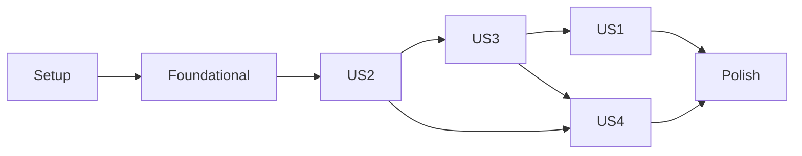

---

description: "Task list for feature 002 — OpenMRS Demo Data Remap, Import, and OpenELIS Cross-Load Analysis"
---

# Tasks: OpenMRS Demo Data Remap, Import, and OpenELIS Cross-Load Analysis

**Input**: Design documents from `/specs/002-openmrs-demo-data-2-8-remap/`

**Prerequisites**: plan.md (required), spec.md (required for user stories), research.md, data-model.md, contracts/

**Tests**: Behavioral changes MUST include tests. Documentation-only changes may mark tests as N/A with a short justification.

**Organization**: Tasks are grouped by user story for independent implementation and testing.

## Format: `[ID] [P?] [Story] Description`

- **[P]**: Can run in parallel (different files, no dependencies on incomplete tasks)
- **[Story]**: Which user story this task belongs to (US1, US2, US3, US4); omitted for setup, foundational, and polish phases
- Include exact file paths in descriptions

## Path Conventions

Harness/control-plane layout per plan.md §Project Structure. New 002 modules live under `harness/<package>/`; reviewed artifacts under `datasets/mappings/` and `datasets/transforms/sqlmesh/`; pinned OCL snapshots under `datasets/sources/ocl/`; tests under `evals/<area>/`; per-run outputs under `artifacts/<run-id>/` (gitignored).

---

## Deferred from the M2-A close PR (PR #10)

The following task groups are explicitly deferred to follow-up plans. M2-A close gates them; building them before the audit/recovery infrastructure (`scripts/reset-transform.sh`, per-mart row-count audits, fresh-replay test, state-drift detector) inverts dependencies.

- **Phase 5 — Loadback + smoke (T059–T064)**: depends on a stable, audit-attested transform. Open a new feature/plan when M2-A close lands and Phase 5 is the next slot.
- **Phase 5 — M2-F.1 live chartsearchai (T064a–f)**: the live chartsearchai docker-compose stack against the translated demo (SC-015). 6 sub-tasks including an optional Playwright UI walkthrough. Defer to a separate plan once the transform is rock-solid.
- **Phase 5 — Sampler (T065–T067)**: depends on the live transform + binding probes; defer with the rest of Phase 5.
- **Phase 6 — OpenELIS analysis (T068–T075)**: parallel-track work; pick up after Phase 5 ships.
- **T077 PCCP records — drop the preflight plan**: spec.md:265 says heavyweight PCCPs are reserved for changes that materially affect downstream consumers. The earlier T077 planned 6 upfront records; we now author them lazily.

---

## Phase 0.5: Operator Infrastructure (Reusable Stack + OCL Pipeline)

**Purpose**: User-facing wrappers around M0 primitives so the operator never has to retype docker/compose/curl commands. Built during initial exploration of the dataset (commits 6c23075..b5c8362). Maps to G6 finding in `/speckit-analyze` (work products that existed without corresponding tasks).

- [X] T000a Operator infrastructure: Caddy reverse proxy + Caddyfile in `compose/Caddyfile`; updated `compose/openmrs-2.8-refapp.yml` so gateway/frontend/backend are no longer host-exposed and a single configurable `HARNESS_PROXY_HTTP_PORT` (default 8088) fronts the stack. Resolves OrbStack-owns-8080 conflict and gives a single extension point for future services (chartsearchai gateway, etc.) via additional `handle` blocks. Includes a 256MB request_body cap and a backend-bypass route for OCL import uploads (gateway nginx defaults to 1MB).
- [X] T000b Operator infrastructure: stack lifecycle scripts under `scripts/`: `stack-up.sh`, `stack-down.sh`, `stack-reset.sh`, `stack-status.sh`. Plus `Makefile` targets `make up / down / reset / status / logs`.
- [X] T000c Operator infrastructure: OCL credentials helper. `scripts/setup-ocl-keychain.sh` installs the OCL API token into macOS keychain with `-T /usr/bin/security` ACL whitelist so reads are silent (no password / Touch ID prompts). `harness/ocl/credentials.py` exposes `get_token()` resolving env first (`OCL_TOKEN`), then keychain (`OCL_KEYCHAIN_SERVICE`, default `ocl-token`).
- [X] T000d Operator infrastructure: CIEL fetch + bootstrap. `scripts/fetch-ciel-release.sh --version <vYYYY-MM-DD>` downloads the OCL export ZIP, computes SHA-256, writes provenance.json. `harness/ocl/bootstrap.py` exposes `set_subscription / upload_import_zip / wait_for_import / bootstrap_ciel`. `scripts/ciel-baseline-up.sh` is the end-to-end idempotent wrapper.
- [X] T000e Operator infrastructure: baseline snapshot fast-path. `scripts/snapshot-baseline.sh` mysqldumps concept-* + openconceptlab_* tables deterministically into `datasets/sources/ocl/CIEL/<version>/seeded-baseline.sql` after a successful import. `scripts/load-baseline.sh` is the inverse (load SQL into fresh MariaDB). Subsequent `make reset && make ciel-baseline` cycles use the SQL fast-path (seconds) instead of redoing the OCL import.
- [X] T000f Operator infrastructure: `.gitguardian.yaml` to whitelist the documented public OpenMRS demo defaults (`openmrs/openmrs` DB password, `Admin123` admin password) so PR scans don't keep re-flagging them as secrets.
- [X] T000g Operator infrastructure: `scripts/load-demo-data.sh` — load the 2.7 demo dump (`data/large-demo-data-2-7-0.sql`, 114MB, 143 tables) into a disposable `legacy_27_raw` database on the harness MariaDB container, side-by-side with the live `openmrs` DB the RefApp 3.6.0 stack uses. Idempotent (`--reset` to drop+reload). Unblocks T021/T024 — the loader was previously folded into T021's description; this extracts it as its own reusable script.

**Checkpoint**: Operator can `make up` and `make ciel-baseline` from a clean checkout (given OCL token in keychain) and reach a CIEL-loaded O3 RefApp at `http://localhost:8088/openmrs/spa`.

---

## Phase 0.6: Public docs site (retroactive — already landed)

**Purpose**: collaborator-facing reading view of the spec + canvases. Deployed from `main` to GitHub Pages at `https://pmanko.github.io/clinical-ai-validation-harness/` via `.github/workflows/pages.yml`.

- [X] T000h Public docs site scaffold: `site/` directory with Vite + React + a `cursor/canvas` polyfill (`site/cursor-canvas.tsx`) implementing the ~20 components used by the 5 `.canvas.tsx` files. Uses `dagre` for `computeDAGLayout`, `recharts` for `BarChart`, static dark theme matching the in-Cursor look. Resolves alias `cursor/canvas → ./cursor-canvas.tsx` at build time so canvases in `specs/` import the polyfill without modification.
- [X] T000i Markdown render pipeline: inline Vite plugin in `site/vite.config.ts` transforms `.md` files into modules exporting `{ raw, html }` via `marked`. `SpecView` consumes `mod.html`.
- [X] T000j Curated information architecture: `site/nav.ts` encodes the navigation tree (Start here / Active features / Cross-cutting canvases / Planning artifacts / Sibling-project context). `site/App.tsx` renders a collapsible-tree sidebar with state persisted in localStorage. Prev/next walks the canonical doc order.
- [X] T000k Welcome dashboard + GH Pages deploy: hero stats, canvas card grid, doc lists grouped by nav section. `.github/workflows/pages.yml` builds + deploys on push to `main` using `actions/deploy-pages@v4`. Pages enabled with source = GitHub Actions.

**Checkpoint**: `cd site && npm run dev` opens the local dashboard; push to `main` deploys.

---

## Phase 1: Setup (Shared Infrastructure)

**Purpose**: Project dependencies, tooling, and directory scaffolding 002 needs in addition to the M0 control-plane primitives.

- [X] T001 Add 002 runtime dependencies to `pyproject.toml` (sqlmesh>=0.150, fhir.resources>=7.0, mariadb-connector-python or PyMySQL, requests, ocldev or equivalent) and refresh `uv.lock`. **Landed in commit `0f671da` (PyMySQL chosen over mariadb-connector-python).**
- [ ] T002 [P] Add Java/FHIR Validator setup notes to `docs/local-dev-setup.md` and `Makefile` target `make fhir-validator` that pulls the pinned `org.hl7.fhir.validator` JAR into `tools/fhir-validator/`
- [ ] T003 [P] Add `tools/fhir-validator/` to `.gitignore`; commit a `tools/fhir-validator/.gitkeep` and a `tools/fhir-validator/VERSION` pin file recording the validator version expected at run time
- [X] T004 [P] Create empty package directories with `__init__.py` for the new 002 harness packages: `harness/profile/`, `harness/conceptmap/`, `harness/ocl/`, `harness/transform/`, `harness/refapp_binding/`, `harness/sampler/`, `harness/openelis/`. **Landed in commit `0f671da`.**
- [X] T005 [P] Create empty test directories with `__init__.py` and a top-level `conftest.py` placeholder: `evals/conceptmap_conformance/`, `evals/sqlmesh_conformance/`, `evals/sampler/`, `evals/refapp_binding/`, `evals/openelis_analysis/`. **Landed in commit `0f671da`.**
- [ ] T006 Document 002 prereqs in `specs/002-openmrs-demo-data-2-8-remap/quickstart.md` cross-reference: ensure quickstart §0 mentions Java 17+, `uv`, Maven (already there), and the FHIR Validator pull step

**Checkpoint**: Dependencies declared, package skeletons exist, no behavioral code yet.

---

## Phase 2: Foundational (Blocking Prerequisites)

**Purpose**: Cross-story infrastructure: harness CLI wiring, run-manifest extension, OCL snapshot loader, target registry consumption helpers.

**⚠️ CRITICAL**: No user story implementation begins until this phase is complete.

- [X] T007 Implement run-manifest 002 extensions in `harness/metadata.py`: add a `RunManifest002Extensions` helper that augments the base `RunManifest.to_dict()` payload with the top-level keys defined in `specs/002-openmrs-demo-data-2-8-remap/contracts/run_manifest_002_extensions.schema.yaml` (conceptmap_path/checksum, sqlmesh_project_path/checksum, ocl_collection_versions[], openmrs_refapp_image_digest, mariadb_image_digest, fhir_validator_version, sqlmesh_version, python_version, policy_buckets[], reviewer_signoffs[]). **Landed in commit `0f671da`; extended in `c615137` with `materialized_outputs[]` for SC-004 per-table determinism evidence.**
- [ ] T008 [P] Add 002 manifest extension validator test in `evals/metadata/test_run_manifest_002_extensions.py`: round-trip a sample manifest through `RunManifest.to_dict()` + extensions; assert it validates against both the M0 base schema and the 002 extensions schema
- [ ] T009 [P] Implement `harness/ocl/snapshot.py`: load a pinned OCL collection snapshot directory (`datasets/sources/ocl/<collection>/<version>/`), expose typed accessors for CIEL concepts, LOINC reference terms, and `provenance.json` metadata; refuse to load if `provenance.json` is missing
- [ ] T010 [P] Add OCL snapshot loader test in `evals/dataset_import/test_ocl_snapshot_loader.py`: fixture pinned mini-snapshot under `evals/_fixtures/ocl-mini/CIEL/test-v1/`; assert loader rejects missing provenance and returns expected concept count for the fixture
- [ ] T011 [P] Extend `harness/cli.py` with 002 subcommand entry points (no implementations yet, just argument parsing skeletons): `profile`, `conceptmap candidates|validate|seed-emit`, `transform run`, `import-smoke`, `sample`, `openelis analyze`, `manifest finalize`, `ocl refresh`. Each prints "not yet implemented" but returns the documented exit codes
- [ ] T012 [P] Add CLI argument-parsing test in `evals/orchestration/test_cli_subcommands.py`: dispatch each new subcommand with `--help`; assert exit code 0 and presence of expected flags from quickstart.md
- [X] T013 [P] Implement `harness/conceptmap/load.py`: parse a FHIR R4 ConceptMap JSON with `fhir.resources`, surface `element.target.equivalence` + the harness extensions defined in `contracts/conceptmap.profile.md` (`policy-bucket`, `source-record-examples`, optional `seed-augment-class`, `seed-augment-reference-term`); typed dataclasses returned. **Landed in commit `0f671da`.**
- [X] T014 [P] Add ConceptMap-load test in `evals/conceptmap_conformance/test_load.py`: load a minimal fixture ConceptMap; assert harness-extension parsing and the cross-element constraints from `contracts/conceptmap.profile.md` (every entry has policy-bucket, single target, seed-augment entries have reference term). **Landed in commit `0f671da`.**
- [ ] T015 PCCP scaffolding: create `specs/002-openmrs-demo-data-2-8-remap/pccp/TEMPLATE.md` referencing `specs/artifacts/planning/pccp-change-record-template.md`; add a smoke test `evals/metadata/test_pccp_records.py` that asserts every committed `pccp/*.md` cites ≥1 before/after record example. (See also T077 for the per-decision PCCP records this template will be instantiated into.)
- [ ] T016 Implement `harness/config.py` extension: a `get_feature_002_paths()` helper returning the canonical paths from `data-model.md` §0 (datasets/mappings/, datasets/transforms/sqlmesh/, datasets/sources/ocl/, artifacts/<run>/ subdirs) so individual modules don't hard-code them

**Checkpoint**: Foundation ready — user story implementation can begin.

---

## Phase 3: User Story 2 — Profiling and terminology inventory (Priority: P1) 🎯 MVP foundation

**Maps to milestone M2-A.**

**Goal**: Produce a deterministic profile of the source corpus (populated tables, row counts, concept reference sources, locales, modules), a schema/metadata diff vs a clean baseline, and a per-changeset Liquibase cost estimate.

**Independent Test**: Run `harness-cli profile --source data/large-demo-data-2-7-0.sql` from a clean baseline; verify `artifacts/<run>/profile/inventory.json` enumerates every populated table + reference source + locale, `artifacts/<run>/schema-diff/diff.json` flags each diff item as `clinical_meaningful: true|false` per the §R5 rule, and `artifacts/<run>/profile/liquibase-cost-estimate.json` classes every 2.7→2.8 changeset against the corpus row counts — all without producing any transformed data.

### Tests for User Story 2 (write first, ensure they fail before implementation)

- [ ] T017 [P] [US2] Contract test for profile inventory JSON shape in `evals/dataset_import/test_profile_inventory_contract.py`: validate against `contracts/profile_inventory.schema.yaml`
- [X] T018 [P] [US2] Contract test for schema diff JSON shape in `evals/dataset_import/test_schema_diff_contract.py`: validate against `contracts/schema_diff.schema.yaml`; assert `clinical_meaningful` is populated per the §R5 rule. **Implemented:** schema-walker validates emitted diff structure (item categories, required fields, rationale presence on clinical_meaningful=true entries); 2 unit assertions + 3 DB-backed integration tests (skipped without stack).
- [ ] T019 [P] [US2] Contract test for Liquibase cost estimate shape in `evals/dataset_import/test_liquibase_cost_contract.py`: validate against `contracts/liquibase_cost.schema.yaml`
- [X] T020 [P] [US2] Scenario-diversity test in `evals/dataset_import/test_profile_scenarios.py`: assert profile surfaces ambiguous concept reference sources, missing locales, orphan FK candidates, and unbundled-module table cases at record level (FR-024). **Implemented:** 4 pure-unit assertions (zero-source-references, missing locales, removed-module status, clinical table classification for promotion targets) + 3 DB-backed integration assertions (skipped without docker/legacy_27_raw+openmrs). Test surfaced and fixed a `CLINICAL_TABLES` gap: `test_order` (P4 promotion target) was missing.

### Implementation for User Story 2

- [X] T021 [P] [US2] Implement `harness/profile/inventory.py`: enumerate populated tables, row counts, populated columns (with non-null/distinct counts), PK ranges, FK in/out per `contracts/profile_inventory.schema.yaml`. Loads source dump into disposable `legacy_27_raw` schema via the M0 compose `db` service. **Implemented:** `harness/profile/inventory.py` (tables[] core + orchestrator), `harness/profile/db.py` (mariadb subprocess helper — swap to PyMySQL when T001 lands), `harness/profile/__main__.py` (`python3 -m harness.profile inventory`). Loader is `scripts/load-demo-data.sh` (T000g). First artifact at `artifacts/legacy-27-raw-baseline/profile/inventory.json` (143 tables, 52 populated, source sha256 `a7ca4bbe…`). reference_sources/locales/modules emitted as empty arrays until T022/T023 land.
- [X] T022 [P] [US2] Implement `harness/profile/terminology.py`: enumerate every row in `concept_reference_source` + the `concept_reference_map` count per source; enumerate locales referenced by `concept_name` / `concept_description` / `global_property.allowed.locale.list`. **Implemented:** `ReferenceSource` + `LocaleUsage` dataclasses, `enumerate_reference_sources`, `enumerate_locales`, `DEFAULT_REFAPP_LOCALES`. Wired into `harness/profile/inventory.py` via the new `--target-db` flag on `python -m harness.profile inventory`.
- [X] T023 [P] [US2] Implement `harness/profile/modules.py`: classify each table by inferred owning module (Platform/Core, htmlformentry, formentry, hl7, dataintegrity, etc.) and check status against the M0 RefApp bundle by comparing against the CIEL-loaded `openmrs` schema introspection. **Implemented:** prefix-match table classifier with longest-first ordering (`openconceptlab_`, `htmlformentry_`, `formentry_`, `dataintegrity_`, `metadatasharing_`, etc.), Platform/Core fallback table set, `classify_modules` pure function emits `status_in_2_8_refapp ∈ {bundled, optional, removed, unknown}`. Wired into the inventory artifact alongside terminology.
- [X] T024 [US2] Replace `harness/schema_diff.py` stub with the real implementation: introspect MariaDB `legacy_27_raw` and `openmrs` schemas; produce items per `contracts/schema_diff.schema.yaml` with `clinical_meaningful` set per the §R5 rule. Depends on T021 (profile inventory feeds reference-table membership). **Implemented:** real introspection (`list_tables`, `list_columns`, `list_indexes`, `list_foreign_keys`, `populated_tables`), §R5 classifier (`CLINICAL_TABLES` set, `CLINICALLY_LOADED_COLUMN_SUFFIXES`, `_is_clinically_loaded_column`, `classify_table_diff`, `classify_column_diff` — all pure for testability), diff orchestration (`diff_table_inventories`, `diff_shared_table`, `diff_schemas`), output writer with summary.md. CLI compatibility preserved via `write_schema_diff` fallback when stack down.
- [X] T024a [US2] **CIEL-load step (implemented).** Boot the O3 RefApp full stack against an empty MariaDB via `scripts/stack-up.sh`; use the bundled `openmrs-module-openconceptlab` (already in the distro per research §R-Terminology-Stack); invoke its **offline-import** path against the pinned CIEL export at `datasets/sources/ocl/CIEL/<version>/` via `scripts/ciel-baseline-up.sh` (which calls `harness/ocl/bootstrap.py`'s `bootstrap_ciel()`). Actual file paths (vs. earlier `harness/profile/ciel_baseline.py` placeholder): `scripts/ciel-baseline-up.sh`, `harness/ocl/bootstrap.py`, `scripts/fetch-ciel-release.sh`. Resulting concept tables are snapshotted by T024b. Closes the previously-implicit gap in M2-A.
- [X] T024b [US2] **Snapshot the seeded baseline + commit.** After T024a's import completes, run `scripts/snapshot-baseline.sh --version <vYYYY-MM-DD>` to dump concept-* + openconceptlab_* tables to `datasets/sources/ocl/CIEL/<version>/seeded-baseline.sql` with deterministic flags (no comments, no dump-date, INSERT IGNORE). Write `seeded-baseline.provenance.json` (SHA-256 + size + generation time). Provenance is committed; the 188MB SQL itself is gitignored (regeneratable by re-running the snapshot script against a freshly imported stack) — same policy as the pinned CIEL ZIP. Future fresh restarts (`make reset && make ciel-baseline`) use this SQL via the fast-path in `scripts/ciel-baseline-up.sh`.
- [X] T024c [US2] **Enumerate openconceptlab import errors at record level** (per research §R-Import-Error-Tolerance — added alongside this task; see U3 in `/speckit-analyze`). Hit the openconceptlab module's `/openmrs/ws/rest/v1/openconceptlab/import/<uuid>/item?state=ERROR` (or equivalent) to list every item that failed import. Emit `artifacts/<run>/profile/ciel-import-errors.json` with per-record evidence (concept identity if available, error message, item type). Assert error rate ≤ 0.1% of total items; fail the M2-A gate otherwise. Satisfies constitution Principle III (record-level evidence) for the CIEL load.
- [ ] T025 [US2] Implement `harness/profile/liquibase_cost.py`: parse the OpenMRS Core 2.7→2.8 Liquibase changelog (via the running RefApp's metadata table or via a vendored snapshot under `tools/openmrs-core-liquibase/`), classify each changeset by cost class given corpus row counts and the known-expensive patterns from research.md §R-Liquibase
- [ ] T026 [US2] Wire `harness-cli profile` end-to-end in `harness/cli.py`: orchestrate compose-up of the `db` service via `harness.compose`, load source dump, run inventory + terminology + modules + schema-diff + liquibase-cost, emit all four artifacts under `artifacts/<run>/profile/` and `artifacts/<run>/schema-diff/`
- [ ] T027 [US2] Emit per-stage events via `harness.metadata.append_event` (`profile_start`, `profile_table`, `profile_complete`, `diff_start`, `diff_item`, `diff_complete`, `liquibase_cost_estimated`) with `decision_rationale` populated for items marked `clinical_meaningful: true`
- [ ] T028 [US2] Record-level evidence test in `evals/dataset_import/test_profile_record_evidence.py`: assert every `diff_item` event carries the source/target record IDs that exemplify the diff, not just aggregate counts (constitution III)

**Checkpoint**: M2-A complete. Reviewer can sign the profile + diff + Liquibase cost outputs to gate M2-C/D.

---

## Phase 4: User Story 3 — Terminology translation as a first-class reviewed deliverable (Priority: P1)

**Maps to milestone M2-C. Anchors on US2's `inventory.json` output.**

**Goal**: Produce a reviewed FHIR R4 ConceptMap mapping every source-record-referenced concept to the 2.8 seeded CIEL dictionary, with equivalence labels, policy buckets, source-record examples, and reviewer rationale. Validated by an unmodified HL7 FHIR Validator CLI and harness profile-only checks.

**Independent Test**: From a profile output, run `harness-cli conceptmap candidates --profile artifacts/<run>/profile/inventory.json`; review the candidate proposal; promote to `datasets/mappings/openmrs-2.7-to-2.8.conceptmap.json`; run `harness-cli conceptmap validate ...`; FHIR Validator passes; harness profile-only checks pass; every source concept referenced by ≥1 clinical row has a target + equivalence + policy bucket.

### Tests for User Story 3

- [ ] T029 [P] [US3] Contract test in `evals/conceptmap_conformance/test_profile.py`: load a fixture ConceptMap, assert all harness profile requirements from `contracts/conceptmap.profile.md` (URL, status, sourceUri/targetUri, single-target, equivalence vocabulary, policy-bucket extension, source-record-examples extension)
- [ ] T030 [P] [US3] Cross-element constraint test in `evals/conceptmap_conformance/test_coverage.py`: assert every source concept_id referenced by ≥1 clinical row in a fixture profile appears in the ConceptMap with a policy bucket (FR-CD1)
- [ ] T031 [P] [US3] Seed-augmentation bounds test in `evals/conceptmap_conformance/test_seed_augment_bounds.py`: assert `policy-bucket = seed-augment` entries have `concept_class` ∈ {Test, LabSet, Drug, Diagnosis, Finding, Symptom} AND a published reference term (research.md §R6)
- [ ] T032 [P] [US3] FHIR Validator integration test in `evals/conceptmap_conformance/test_fhir_validator.py`: invoke the pinned validator JAR on a fixture; assert pass on a valid file and fail with a clear message on each of 5 scenario-diverse failure cases (missing equivalence, unknown extension URL, duplicate target.code, missing comment, `seed-augment` without reference term)

### Implementation for User Story 3

- [ ] T033 [P] [US3] Implement `harness/ocl/candidates.py`: given a profile + pinned CIEL snapshot, produce candidate ConceptMap entries by matching source concepts to seeded CIEL concepts that share a reference term (LOINC/SNOMED/ICD-10/RxNorm). Writes to `artifacts/<run>/conceptmap-candidates.json` (not under `datasets/`)
- [ ] T034 [P] [US3] Implement `harness/conceptmap/validate.py`: invoke the FHIR Validator CLI on the accepted ConceptMap; layer harness profile-only checks (single-target, harness extensions, cross-element coverage, seed-augment bounds); structured pass/fail report
- [ ] T035 [US3] Wire `harness-cli conceptmap candidates|validate` in `harness/cli.py` (depends on T033, T034)
- [ ] T036 [US3] Author the initial accepted ConceptMap at `datasets/mappings/openmrs-2.7-to-2.8.conceptmap.json` covering every source concept_id referenced by ≥1 clinical row in the 2.7 corpus. Use OCL candidate-mining (T033) as the starting input. Each entry carries target + equivalence + policy-bucket extension + source-record-examples extension + reviewer comment.
- [ ] T037 [US3] Author the companion review document `datasets/mappings/openmrs-2.7-to-2.8.conceptmap.review.md`: per-bucket counts, reviewer identity, signoff date, summary of seed-augment decisions, open follow-ups, cross-reference to the OCL CIEL snapshot version used
- [ ] T038 [US3] Emit `conceptmap_loaded` and `conceptmap_validated` events via `harness.metadata.append_event` with `decision_rationale` capturing reviewer identity + signoff timestamp + validator version
- [X] T039 [US3] Implement `harness/conceptmap/seed_emit.py`: read the accepted ConceptMap, emit `datasets/transforms/sqlmesh/seeds/concept_translation.csv` with columns `(source_concept_id, source_uuid, target_concept_id, target_uuid, equivalence, policy_bucket, source_record_examples)`. Deterministic given the same input ConceptMap. **Landed in commit `de20aca`.**
- [ ] T040 [US3] Seed-emit determinism test in `evals/conceptmap_conformance/test_seed_emit_determinism.py`: run seed-emit twice on a fixture; assert byte-identical output; assert checksum matches the value `harness.conceptmap.seed_emit` would compute

**Checkpoint**: M2-C complete. Reviewer has signed `openmrs-2.7-to-2.8.conceptmap.json`. The seed CSV exists and is ready for SQLMesh consumption.

---

## Phase 5: User Story 1 — Reproducible OpenMRS demo database on the O3 RefApp + first real chartsearchai milestone (Priority: P1) 🎯 MVP end-state

**Maps to milestones M2-D, M2-E, M2-F, M2-F.1 (first real milestone — SC-015), M2-G. Anchors on US2 (profile/diff) and US3 (ConceptMap + seed CSV).**

**Goal**: Author the SQLMesh project, run the deterministic transform, import the result into a live O3 RefApp 3.x backend on Core 2.8.x, run chartsearchai's declared validation surface plus the harness binding layer, **then bring up the live chartsearchai docker-compose stack against the translated demo and verify SC-015 (clinician-facing AI answer with citations)**, and verify the translation-coverage sampler reports record-level evidence per policy bucket.

**Independent Test**: From an accepted ConceptMap (US3) and a clean baseline, run `harness-cli transform run && harness-cli import-smoke && harness-cli chartsearchai-live && harness-cli sample --seed 42`. Expect: deterministic SQLMesh output (two runs byte-identical under documented normalization), live O3 RefApp boots within the SC-001 budget, chartsearchai `mvn -pl api test` runs green (self-tests), the live chartsearchai chat returns an answer with ≥1 citation that resolves to a translated record (SC-015), every policy bucket has ≥1 record sampled.

### Tests for User Story 1

- [ ] T041 [P] [US1] Contract test for transform output dump format in `evals/dataset_import/test_transform_output_contract.py`: assert `artifacts/<run>/transform/refapp_28_demo.sql` parses as MySQL/MariaDB schema-and-data dump and is loadable into an empty MariaDB
- [ ] T042 [P] [US1] Contract test for coverage sampler output in `evals/sampler/test_coverage_sample_contract.py`: validate against `contracts/coverage_sample.schema.yaml`
- [ ] T043 [P] [US1] Deterministic re-run test in `evals/dataset_import/test_transform_determinism.py`: run transform twice from same inputs; assert byte-identical output (with documented normalization for timestamps)
- [ ] T044 [P] [US1] Liquibase upgrade-in-place test in `evals/dataset_import/test_liquibase_import.py`: import a small fixture transformed dump into a fresh MariaDB; bring up the O3 backend; assert Liquibase completes without errors within the budget from `artifacts/<run>/profile/liquibase-cost-estimate.json`
- [ ] T045 [P] [US1] Scenario-diversity test for binding check in `evals/refapp_binding/test_binding_scenarios.py`: assert specific failure surfaces for (a) unrenderable bundled form due to missing translated concept, (b) unresolvable default order type, (c) drug catalog concept gap; each surfaces record IDs not aggregates
- [ ] T046 [P] [US1] Sampler determinism test in `evals/sampler/test_sampler_determinism.py`: two runs with same seed produce identical sample IDs; different seeds produce different samples; declared-empty buckets reported correctly
- [ ] T047 [P] [US1] Cross-target chartsearchai integration test marker in `evals/dataset_import/test_chartsearchai_runs.py`: assert the harness CLI invokes `mvn -pl api test` inside `targets/chartsearchai/` via `harness.targets.targets.chartsearchai.validation_surface.command` and captures the surefire XML under `artifacts/<run>/chartsearchai-tests/`

### Implementation for User Story 1 — M2-D (SQLMesh project)

- [X] T048 [P] [US1] Create `datasets/transforms/sqlmesh/config.yaml` per `contracts/sqlmesh_project.profile.md`: gateway `harness` pointing at MariaDB via environment vars, default gateway, model defaults. **Landed in `45615ed`; `model_defaults.kind: FULL` added in `fe34090`.**
- [X] T049 [P] [US1] Create staging models under `datasets/transforms/sqlmesh/models/staging/` — one model per source table (1:1 copy from `legacy_27_raw.<table>` into `refapp_28_demo`), each with description, policy_bucket tag, audits. **Landed in `45615ed` (39 staging models). Composite-PK exceptions documented in `contracts/sqlmesh_project.profile.md` and asserted via `evals/sqlmesh_conformance/test_composite_pk_uniqueness.py` per commit `5d6d6d0`.**
- [X] T050 [US1] Create terminology model `datasets/transforms/sqlmesh/models/terminology/concept_rebind.sql` that exposes legacy obs with concept_id + value_coded rebound via the bridge rule (joins stg_obs to seed__concept_translation). Depends on T039 (seed emitted). **Landed in commit `22f9094`.**
- [ ] T051 [US1] Create clinical models under `datasets/transforms/sqlmesh/models/clinical/`: one per `obs`, `conditions`, `diagnosis`, `allergy`, `drug_order`, `encounter_diagnosis`, each joining staging to terminology and emitting translated concept references. Depends on T049, T050. **Sub-tasks for the 4 structural promotions** (per spec FR-029 and `data-model.md` §R-promotion-rules):
  - [X] T051a [US1] `models/clinical/drug_order.sql` (P1) — `obs WHERE value_coded.concept_class = 'Drug'` → drug_order. Row-count floor enforced by `audits/audit_drug_order_row_count_min.sql`. **Landed in `45615ed`; audit wired in `c6b608e`.**
  - [X] T051b [US1] `models/clinical/conditions.sql` (P2) — `obs WHERE concept_id = 6042` (PROBLEM ADDED) → conditions. Row-count floor enforced by `audits/audit_conditions_row_count_min.sql`. **Landed in `45615ed`; audit wired in `c6b608e`.**
  - [X] T051c [US1] `models/clinical/allergy.sql` (P3) — `obs WHERE concept_id IN (6011, 6012, 1083) AND value_coded = 1065` (YES) → allergy. Row-count floor enforced by `audits/audit_allergy_row_count_min.sql`. **Landed in `45615ed`; audit wired in `c6b608e`.**
  - [X] T051d [US1] `models/clinical/test_order.sql` (P4) — `obs WHERE concept.concept_class = 'Test' AND datatype = 'Coded'` → test_order. Row-count floor enforced by `audits/audit_test_order_row_count_min.sql`. **Landed in `45615ed`; audit wired in `c6b608e`.**
- [X] T052 [US1] Create module-policy models under `datasets/transforms/sqlmesh/models/modules/`: orphan-carry-forward / drop / install-module / remap per module per `seeds/module_table_policy.csv`. Author the policy CSV alongside. **Seed CSV landed in `de20aca`; 16 carry-forward models generated by `harness/transform/gen_modules.py` in commit `22f9094`. 6 over-long-named tables deferred (documented in review.md).**
- [X] T053 [US1] Create audit views under `datasets/transforms/sqlmesh/models/audit_views/`: row-level audit with equivalence-label decoration (source_table, source_pk, target_table, target_pk, policy_bucket, equivalence_label). **Landed in commit `22f9094` (`aud__equivalence_decoration`).**
- [X] T054 [P] [US1] Create SQLMesh audits under `datasets/transforms/sqlmesh/audits/`: ConceptMap-coverage cross-audit, FK-closure cross-audit, policy-bucket-coverage cross-audit, plus per-model unique/not-null audits. **Cross-model audits landed in `45615ed`. Per-mart row-count-min audits added in `c6b608e` (5 audits).**
- [X] T055 [US1] Author `datasets/mappings/openmrs-2.7-to-2.8.review.md`: per-model reviewer rationale index, mapping from schema-diff items to covering models, checklist of clinically-meaningful diff items covered. **Landed in commit `de20aca`; carry-forward deferral section added in `22f9094`.**

### Implementation for User Story 1 — M2-E (Transform execution)

- [X] T056 [US1] Implement `harness/transform/run.py`: orchestrate `sqlmesh seed && sqlmesh run && sqlmesh audit` against the live MariaDB; capture run logs + content-fingerprint versions; dump `refapp_28_demo` to `artifacts/<run>/transform/refapp_28_demo.sql`. **Landed in commit `45615ed`; extended in `c615137` with `materialized_outputs[]` stamping (per-table SHA-256 + row counts in `transform.report.json`).**
- [ ] T057 [US1] Implement `harness/transform/orphan_fk.py`: post-run FK-orphan detection across the produced `refapp_28_demo`; emit `artifacts/<run>/transform/orphan-fk-report.json`; fail if any unrepaired orphans exist
- [ ] T058 [US1] Wire `harness-cli transform run` in `harness/cli.py` (depends on T056, T057); emit `sqlmesh_seed`, `sqlmesh_run_model`, `sqlmesh_audit`, `orphan_fk_detected` events with rationale

### Implementation for User Story 1 — M2-F (Import smoke + RefApp tests + binding)

- [ ] T059 [US1] Replace `harness/import_smoke.py` stub with real implementation: bring down the live `db`/`backend`/`frontend`/`gateway` via `harness.compose`, recreate empty MariaDB, load `refapp_28_demo.sql`, restart the O3 backend, wait for Liquibase upgrade-in-place, run REST `/ws/rest/v1/patient` and FHIR `/ws/fhir2/R4/Patient` readback; emit `artifacts/<run>/import-smoke/report.json`
- [ ] T060 [P] [US1] Implement `harness/refapp_binding/forms.py`: render-check bundled forms against translated concepts via REST `/ws/rest/v1/form` and the related concept resolution endpoints
- [ ] T061 [P] [US1] Implement `harness/refapp_binding/orders.py`: default order types resolution; assert every order type's concept_id resolves in the translated dictionary
- [ ] T062 [P] [US1] Implement `harness/refapp_binding/drugs.py`: drug catalog resolution; assert every drug's concept_id resolves
- [ ] T063a [P] [US1] Implement `harness/refapp_binding/vitals.py`: assert each vitals concept used by the translated `obs` rows resolves via REST `/ws/rest/v1/concept` and renders in the O3 vitals UI / FHIR Observation surfaces; record under `artifacts/<run>/refapp-binding/report.json` `vitals[]`
- [ ] T063b [P] [US1] Implement `harness/refapp_binding/allergens.py`: assert allergen concepts referenced by translated `allergy.coded_allergen` resolve and render in the O3 allergy UI / FHIR AllergyIntolerance; record under `report.json` `allergens[]`
- [ ] T063c [P] [US1] Implement `harness/refapp_binding/problems.py`: assert problem-list concepts referenced by translated `conditions.condition_coded` resolve and render in the O3 problem-list UI / FHIR Condition; record under `report.json` `problems[]`
- [ ] T063 [US1] Implement `harness/refapp_binding/__init__.py` orchestrator: run forms+orders+drugs+vitals+allergens+problems; emit `artifacts/<run>/refapp-binding/report.json` covering all six SC-013 concept classes (lab/vitals/problem/allergen/drug/diagnosis); depends on T060, T061, T062, T063a, T063b, T063c
- [ ] T064 [US1] Wire `harness-cli import-smoke` end-to-end in `harness/cli.py`: invokes T059 + T063 + the chartsearchai target validation surface (`harness.targets.targets.chartsearchai.validation_surface.command`); captures surefire XML under `artifacts/<run>/chartsearchai-tests/`. This task closes M2-F (chartsearchai self-tests + binding); M2-F.1 (live chartsearchai data path) is T064a–f below.

### Implementation for User Story 1 — M2-F.1 (First real milestone — live chartsearchai vs translated demo, SC-015)

- [ ] T064a [US1] Implement `harness/refapp_binding/chartsearchai_live.py`: bring up `targets/chartsearchai/docker-compose.yml` (TAG=nightly-chartsearch, image `openmrs/openmrs-reference-application-3-{gateway,frontend,backend}:nightly-chartsearch`) via `harness.compose`, seeding the `db` service with `artifacts/<run>/transform/refapp_28_demo.sql` before chartsearchai's backend bootstraps. Capture compose lifecycle in `artifacts/<run>/chartsearchai-live/compose-up.log`. Health-gate on `GET http://localhost/openmrs/` returning 302 (Tomcat ready) before continuing.
- [ ] T064b [US1] Add indexer-warmup step in `harness/refapp_binding/chartsearchai_live.py`: invoke `POST /ws/rest/v1/chartsearchai/warmup` for a canary patient set drawn from `harness/sampler/sample.py` (depends on T066) **OR** trigger the "Chart Search AI - Embedding Backfill" scheduler task via OpenMRS REST `/ws/rest/v1/scheduler/task`. Records outcomes in `artifacts/<run>/chartsearchai-live/indexer-warmup.json` — closes coverage gap for FR-014 (search index population).
- [ ] T064c [US1] Live REST-flow test in `evals/refapp_binding/test_chartsearchai_live_search.py`: POST `/ws/rest/v1/chartsearchai/search` for ≥1 known translated patient with a representative clinical question (e.g., "What medications is this patient on?"); assert response schema (`answer`, `references[]`, `disclaimer`, `questionId`); persist response to `artifacts/<run>/chartsearchai-live/search-response.json`
- [ ] T064d [US1] Citation-resolution test in `evals/refapp_binding/test_chartsearchai_citation_resolution.py`: take the `references[]` from T064c, look each up against the translated demo's REST endpoints (Encounter, Observation, Order, etc.); assert every cited record exists with concept identity matching the accepted ConceptMap's target side; emit `artifacts/<run>/chartsearchai-live/citation-resolution.json`. This task closes the real-path retrieval loop and satisfies Constitution Principle I.
- [ ] T064e [US1] [optional] Playwright/Cypress UI smoke in `evals/refapp_binding/test_chartsearchai_ui_walkthrough.py`: drive the chartsearchai chat UI per `targets/chartsearchai/README.md` "Try it on the demo server" walkthrough against the translated demo — one known patient, one clinical question, screenshot of answer-with-citations under `artifacts/<run>/chartsearchai-live/ui-screenshot.png`. Marked `[optional]` because Playwright adds CI complexity; covered by T064c+d at the API level for non-UI verification.
- [ ] T064f [US1] Wire `harness-cli chartsearchai-live` in `harness/cli.py`: orchestrate T064a + T064b, then invoke T064c + T064d as pytest runs (T064e if --include-ui); emit `chartsearchai_live_compose_up`, `chartsearchai_live_search_request`, `chartsearchai_live_citation_resolved` events via `harness.metadata.append_event`; close the SC-015 budget timer in the run manifest.

### Implementation for User Story 1 — M2-G (Translation-coverage sampler)

- [ ] T065 [P] [US1] Implement `harness/sampler/policy_buckets.py`: enumerate all policy buckets present in the accepted ConceptMap; report which buckets are non-empty
- [ ] T066 [US1] Implement `harness/sampler/sample.py`: deterministic sampler given a seed and records-per-bucket count; per bucket, sample N records from the imported demo, fetch via REST/FHIR, assert clinical fields preserved per `contracts/coverage_sample.schema.yaml`
- [ ] T067 [US1] Wire `harness-cli sample --seed --records-per-bucket` in `harness/cli.py` (depends on T065, T066); emit `sample_drawn` events with per-record rationale for failures

**Checkpoint**: M2-D / M2-E / M2-F / **M2-F.1 (first real milestone, SC-015)** / M2-G complete. Operator has a reproducible end-to-end pipeline from source dump to imported, validated, sampled demo database on the modern (O3) RefApp **plus a live chartsearchai chat returning grounded answers about translated patients** — satisfying Constitution Principle I.

---

## Phase 6: User Story 4 — OpenELIS cross-load feasibility analysis (Priority: P2)

**Maps to milestone M2-H. Anchors on US2 (profile) and US3 (CIEL mapping). Parallelizable with US1 once US2 and US3 are partial.**

**Goal**: Per-entity feasibility analysis (full / partial / synthesized / not-feasible) for cross-loading the OpenMRS demo into OpenELIS Global, plus a machine-readable mapping skeleton (FHIR ConceptMap for terminology, YAML for structural). No live OpenELIS load; Catalyst submodule referenced as umbrella only.

**Independent Test**: Run `harness-cli openelis analyze --openelis-source /Users/pmanko/code/OpenELIS-Global-2 --openelis-target-version 3.2.1`. Expect: `artifacts/<run>/openelis/feasibility.json` validates against `contracts/openelis_feasibility.schema.yaml`, every required entity (patient, provider, organization, location, test, analyte, order, result, observation, specimen, reference_terminology) classified with source_columns + rationale, LOINC-bridge coverage percent reported for lab entities.

### Tests for User Story 4

- [ ] T068 [P] [US4] Contract test for feasibility JSON shape in `evals/openelis_analysis/test_feasibility_contract.py`: validate against `contracts/openelis_feasibility.schema.yaml`
- [ ] T069 [P] [US4] Coverage test in `evals/openelis_analysis/test_feasibility_entity_coverage.py`: assert all required entities present, each with a feasibility classification + source_columns + rationale
- [ ] T070 [P] [US4] Mapping skeleton contract test in `evals/openelis_analysis/test_skeleton_contract.py`: validate the terminology skeleton against FHIR R4 ConceptMap + `contracts/conceptmap.profile.md` overrides; validate the structural YAML against `contracts/openelis_skeleton.profile.md`
- [ ] T071 [P] [US4] LOINC-bridge coverage test in `evals/openelis_analysis/test_loinc_bridge.py`: assert lab-entity entries have `loinc_bridge_coverage_percent` populated and that the percent matches an independent count of source concepts with LOINC references in the pinned CIEL snapshot

### Implementation for User Story 4

- [ ] T072 [P] [US4] Implement `harness/openelis/feasibility.py`: read OE Global schema by introspecting the sibling checkout at `/Users/pmanko/code/OpenELIS-Global-2/` (read-only; the path is a CLI arg, not a submodule); for each candidate OpenELIS entity, classify feasibility using the OpenMRS profile + accepted ConceptMap + pinned CIEL+LOINC snapshots
- [ ] T073 [P] [US4] Implement `harness/openelis/skeleton_emit.py`: emit `datasets/mappings/openmrs-2.7-to-openelis.skeleton.conceptmap.json` (FHIR ConceptMap targeting LOINC primarily) and `datasets/mappings/openmrs-2.7-to-openelis.skeleton.yaml` (structural per `contracts/openelis_skeleton.profile.md`)
- [ ] T074 [US4] Generate the human-readable `artifacts/<run>/openelis/feasibility.md` from the JSON output with markdown tables per entity
- [ ] T075 [US4] Wire `harness-cli openelis analyze` in `harness/cli.py`; emit `openelis_classification` events per entity with rationale; record `evidence_status: scaffolding` for the OpenELIS portion of the run manifest (Q1 clarification)

**Checkpoint**: M2-H complete. Reviewer can hand the mapping skeleton to a future OpenELIS-loader feature; no live OpenELIS load was attempted under 002.

---

## Phase 7: Polish & Cross-Cutting Concerns (M2-Z + Documentation)

**Purpose**: Finalize provenance, PCCP records, docs, and run-quickstart validation.

- [ ] T076 [P] Implement `harness-cli manifest finalize` in `harness/cli.py`: build the full `artifacts/<run>/run_manifest.json` via `harness.metadata.RunManifest` + T007 extensions; populate `target_provenance[]` for chartsearchai + querystore (if used) + catalyst (scaffolding); close `events.jsonl` with `run_complete`
- [ ] T077 [P] Author PCCP records **lazily** in `specs/002-openmrs-demo-data-2-8-remap/pccp/` only when a material change affects downstream consumers (chartsearchai, OpenELIS). Per spec.md:265 demo-data posture clarification: heavyweight PCCP records are reserved for changes that materially affect downstream consumers, not for per-rule tuning during M2-A iteration. The earlier draft of T077 planned 6 preflight PCCPs (ConceptMap, SQLMesh project, module_table_policy, OCL snapshot pin, RefApp image digest, OpenELIS feasibility) — that contradicts the demo-data posture and is dropped. PCCPs land when the trigger event happens, with before/after record examples per FR-023.
- [ ] T078 [P] Update `README.md`: feature 002 status, quickstart pointer, link to plan.md and tasks.md
- [ ] T079 [P] Update `AGENTS.md` (if present): note that 002 anchors on M0 primitives and consumes `harness/targets.yaml` for cross-target validation
- [ ] T080 [P] Update `specs/artifacts/planning/metadata-schema.md`: cross-reference the 002 manifest extensions schema (`contracts/run_manifest_002_extensions.schema.yaml`)
- [ ] T081 [P] Update `specs/artifacts/planning/data-remap-2.8.md`: cross-reference the final accepted ConceptMap, SQLMesh project, and the chartsearchai validation surface invocation
- [ ] T082 [P] Update `specs/roadmap.canvas.tsx` to mark M1 (feature 002) status from "in progress" to "ready for review" once tasks complete; record the new follow-up entries (multi-vintage corpus remap, future OpenELIS loader)
- [ ] T083 Review validation cases for overfitting: audit `evals/dataset_import/`, `evals/conceptmap_conformance/`, `evals/sampler/`, `evals/refapp_binding/` for tests that only pass on a single specific record; tighten scenario diversity per FR-024
- [ ] T084 Performance pass on M2-A through M2-G: profile each stage to confirm SC-001's <60 min wall-time budget holds on a developer workstation; if any stage exceeds, document in `artifacts/<run>/profile/perf-report.md` and decide whether to optimize or relax SC-001
- [ ] T085 Run `quickstart.md` from a clean checkout end-to-end as the final acceptance test: every step from §1 prereqs through §13 cleanup executes without intervention beyond the documented operator decision points (ConceptMap review, OpenELIS analysis input)

---

## Dependencies & Execution Order

### Phase dependencies

- **Setup (Phase 1)**: No dependencies; can start immediately after M0 + PR #4 are on main (they are).
- **Foundational (Phase 2)**: Depends on Setup completion. BLOCKS all user stories.
- **US2 (Phase 3, M2-A)**: Depends on Foundational. No dependencies on other user stories.
- **US3 (Phase 4, M2-C)**: Depends on Foundational + US2 (needs `profile/inventory.json` to enumerate source concept references).
- **US1 (Phase 5, M2-D/E/F/F.1/G)**: Depends on Foundational + US3 (needs accepted ConceptMap + emitted seed). Implementation tasks within are mostly parallelizable across staging/terminology/clinical/modules/audits. Internal sequence: M2-D/E/F land first; **M2-F.1 (first real milestone, SC-015)** runs after M2-F (depends on the imported translated demo from M2-F and on the sampler bucket-list from T065 for the canary patient set used in indexer warmup).
- **US4 (Phase 6, M2-H)**: Depends on Foundational + US2 + US3. Runs in parallel with US1.
- **Polish (Phase 7, M2-Z)**: Depends on US1, US2, US3, US4.

### Story dependency graph



### Within each user story

- Tests for behavioral changes MUST be written and failing before implementation (constitution V).
- Contracts before models, models before services, services before CLI wiring.
- Record-level evidence + decision-rationale capture in every implementation task that produces validation evidence.

### Parallel opportunities

- Setup tasks T002–T005 are all [P].
- Foundational T008–T014 are mostly [P] (each touches a distinct module/test file).
- Within US2: T017–T020 (tests) all [P]; T021–T023 (profile sub-modules) all [P].
- Within US3: T029–T032 (tests) all [P]; T033–T034 (implementations) [P].
- Within US1: T041–T047 (tests) all [P]; many model files within `models/staging/` and `models/clinical/` are [P]; refapp_binding/forms+orders+drugs are [P].
- Within US4: T068–T071 (tests) all [P]; T072–T073 (implementations) [P].
- US1 and US4 run fully in parallel once US3's ConceptMap is accepted.

---

## Parallel Example: User Story 2 (M2-A)

```bash
# Launch all US2 contract/scenario tests together (T017-T020):
Task: "Contract test for profile inventory JSON shape in evals/dataset_import/test_profile_inventory_contract.py"
Task: "Contract test for schema diff JSON shape in evals/dataset_import/test_schema_diff_contract.py"
Task: "Contract test for Liquibase cost estimate shape in evals/dataset_import/test_liquibase_cost_contract.py"
Task: "Scenario-diversity test in evals/dataset_import/test_profile_scenarios.py"

# Then launch profile sub-module implementations together (T021-T023):
Task: "Implement harness/profile/inventory.py"
Task: "Implement harness/profile/terminology.py"
Task: "Implement harness/profile/modules.py"
```

---

## Implementation Strategy

### MVP-foundation first (US2)

1. Complete Phase 1 (Setup) and Phase 2 (Foundational).
2. Complete Phase 3 (US2 — Profile + Schema Diff + Liquibase Cost).
3. **STOP and VALIDATE**: Reviewer signs the profile output. Without this, US3 has no input.

### Incremental delivery (US2 → US3 → US1 → US4 → Polish)

1. After US2: reviewer signs profile, gates M2-C.
2. After US3: clinically informed reviewer signs ConceptMap; seed CSV emitted; gates M2-D.
3. After US1: full pipeline green from source dump to translated, imported, sampled demo. **This is the MVP end-state.**
4. After US4: OpenELIS mapping skeleton ready for a future loader feature.
5. Polish phase finalizes provenance, PCCP records, doc updates.

### Parallel team strategy

With multiple developers:

1. Team completes Setup + Foundational together.
2. Developer A on US2 first (blocks others).
3. Once US2 ships: Developer A starts US3, Developer B can start prep for US1 model authoring against US3's fixtures.
4. Once US3 ships: Developers split across US1's sub-areas (SQLMesh project / transform exec / smoke+binding / sampler) and US4 (in parallel).
5. Polish phase: all developers contribute concurrently.

---

## Notes

- Every behavioral task carries a test (constitution V); tests are listed under each user story.
- Every transform/mapping/import decision routes through reviewed artifacts under `datasets/` (FR-007, FR-025, FR-026).
- Every release-evidence claim links back to record-level evidence + decision rationale (constitution III, FR-007).
- M0 primitives (`harness.targets`, `harness.compose`, `harness.metadata`, `.gitmodules`, `harness/targets.yaml`) are consumed, not re-implemented.
- No live OCL API calls during transform or smoke (research.md §R7); only the pinned snapshot is read.
- No live OpenELIS bringup under this feature (Q1 clarification); Catalyst submodule is umbrella-only.
- Commit + push after every coherent chunk (memory: `feedback_commit_and_push_early.md`).
