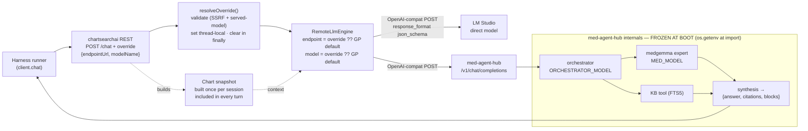
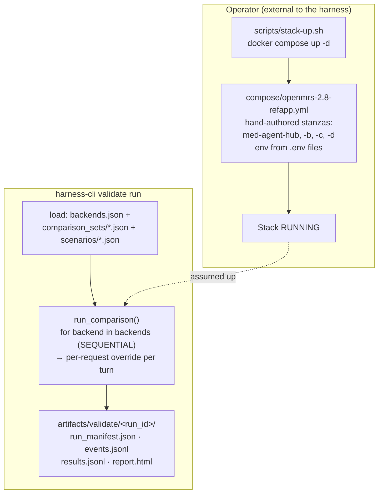
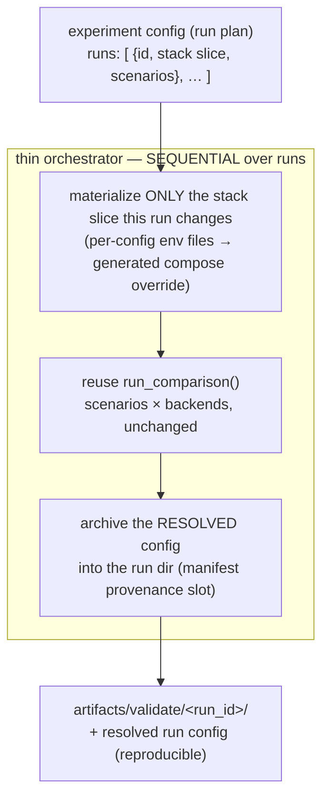

# Harness Architecture Brief — Where We Are, Where We Should Be

**Scope:** how a validation run is configured, executed, and made reproducible.
**Audience:** anyone extending the harness to compare runs across models, prompts, or
chartsearchai versions.

The harness validates clinical-AI behaviour by replaying scenarios against the **real**
stack (OpenMRS + chartsearchai + the LLM tier), not a mock. This brief maps the current
architecture, names the one structural gap, and proposes a config-driven, reproducible
experiment model that **reuses** the existing run loop rather than replacing it.

---

## 1. Where we are

### 1.1 Runtime request path

A turn flows from the harness through the OpenMRS API into chartsearchai, which selects an
LLM endpoint per request and POSTs an OpenAI-compatible body to either a **direct** LM
Studio model or **med-agent-hub** (the in-process team).

**The thesis this diagram carries.** The per-request override (`RequestLlmOverride`,
endpointUrl + modelName only) selects *which endpoint* — and for a direct LLM, *which
model*. It is strictly per-request thread-local, validated without mutating any global
(`ChartSearchAiRestController.resolveOverride()` → `ModelSwitchService.validateEndpointAndModel()`),
and read back by `RemoteLlmEngine.resolveEndpointUrl/ModelName()` (override **else** the
config GP default).

**But the override cannot reach inside med-agent-hub.** The team's orchestrator model,
expert model, and prompt variant are read via `os.getenv` at **module import** and frozen
into a module-level singleton (`med-agent-hub/server/config.py:26-48`; consumed at
`team.py:191`/`:254`, `prompt_loader.py:137`). To run the team with different internals you
must start a med-agent-hub **process with different env**. *This single fact is why the
config problem below exists.*

### 1.2 Control plane

What's true today (grounded): `harness-cli = harness.cli:main` (`pyproject.toml:34`);
`validate run` → `run_comparison()` which loops backends **sequentially** (`runner.py:104`)
and applies the per-request override per turn; `validate report` → `build_report()`. The
manifest (`metadata.py` `RunManifest`) records dataset/git/provider provenance and has open
`target_provenance` / `decision_rationale` slots.

### 1.3 The gap (stated precisely)

We already sequence and already compare multiple backends in one report. The gap is **not**
"no sequencing." It is three narrower things:

| # | Gap | Evidence |
|---|-----|----------|
| **G1** | A run's **stack configuration** (which med-agent-hub env, which chartsearchai) is **hand-wired into compose stanzas** and assumed-running — not declared as config the harness reads. | `compose/...yml` `med-agent-hub-{b,c,d}`; `stack-up.sh` is external; the harness never sets model env. |
| **G2** | The same fact is typed **twice** — compose env *and* the `backends.json` label — which drift. | `backends.json` labels re-state `orch=… expert=…` that live in compose env. |
| **G3** | The **effective stack config is not archived** with the run, so a report can't reproduce itself. | `RunManifest` has dataset/git provenance but no per-run model/variant/chartsearchai config. |

G1 is the root: because team internals are frozen at boot (§1.1), "vary the team" became
"hand-author another compose service" — which doesn't scale, drifts (G2), and isn't
captured (G3).

---

## 2. Where we should be

**Principle:** a run is defined by a **config**; the components are **materialized from
that config**. Booting med-agent-hub twice is correct — the fix is that the instances are
*generated from config*, never hand-authored.

### 2.1 The experiment config (run plan)

One simple, multi-service-capable input file declares a **sequence of runs**. Each run names
the stack slice it needs and the scenarios to replay.

- **Materialize only the diff.** This is what keeps it simultaneously *simple* and
  *multi-service*: the team ladder swaps only med-agent-hub (OpenMRS + chartsearchai stay
  up); a chartsearchai-varying run rebuilds more. Never full-stack-rebuild when one service
  changed.
- **Reuse `run_comparison` per run.** The thin orchestrator loops runs and stands up each
  run's stack; the inner scenarios×backends loop, the per-request override, the envelope
  contract, the metrics, and the report are **unchanged**. We do not pull HTTP logic out of
  the runner.
- **One source of truth.** `backends.json` endpoints and report labels **derive** from the
  run config — G2 (drift) disappears.

### 2.2 med-agent-hub: before → after

| | Today (anti-pattern) | Target (config-driven) |
|---|---|---|
| Instances | hand-authored `med-agent-hub-{b,c,d}` stanzas | **one** parameterized `med-agent-hub` stanza |
| Params | literals / shared `${VAR}` that clobber all instances | **per-config env file** (med-agent-hub already supports `UVICORN_ENV_FILE`, `config.py:11`) |
| Topology | all up at once, hand-wired DNS names | materialized from config; sequential is fine |
| Source of truth | compose **and** backends.json label | the run config only |

### 2.3 Reproducibility

Archive the **resolved** config (after env-substitution / default-fill — *not* the
template) into the run dir, referenced from the manifest's existing provenance slots
(`target_provenance` / `decision_rationale`), so the report reproduces from itself. The
report renders it as the run's self-describing header.

> **v2 follow-up (named, not built now):** capture the *effective* config by introspecting
> the running med-agent-hub (`/health` or a `/config` echo), to drift-proof against the
> declared config diverging from what actually booted.

---

## 3. Settled decisions (from this session)

These are **decided**, not open:

- **Sequential** execution, driven by one **simple input config file** (how many runs, the
  config for each run).
- **Multi-service**: a run can vary OpenMRS/chartsearchai, not only med-agent-hub.
- **Archive the config with the report** for reproducibility.
- **Leaning to a generated compose override** for the varying services (over reconfigure-one
  or a docker-run loop), executed sequentially.
- Per-request override stays the isolation knob for the **direct-LLM** path and for
  *selecting* a team endpoint; it is **not** the mechanism for team internals.

## 4. Genuinely open

- **How chartsearchai variation is expressed** in the run config: image tag (rebuild) vs
  global-property override vs a compose override file. (Tag/rebuild is heaviest; GP override
  is lightest but only covers GP-controlled behaviour.)
- **The exact run-config schema fields** (and whether a "run" reuses the existing
  comparison_set shape with an added `stack` block, or is a new top-level object).

## 5. Suggested sequencing (incremental, demo-appropriate)

1. **Collapse the stanzas.** One parameterized `med-agent-hub` + per-config env files;
   derive `backends.json` endpoints/labels from config. *(This step alone makes the team
   ladder config-driven — it's the degenerate case: one run, stack constant, three team
   instances materialized from config — so the ladder can run now without step 2.)*
2. **Thin experiment orchestrator.** Read the run plan → per run, materialize the stack
   diff → call `run_comparison` → archive the resolved config in the run dir.
3. **Render + drift-proof.** Show the archived config in the report; later, the effective-
   config introspection (§2.3 v2).

Each step is independently shippable; none requires touching the runner's HTTP path.
