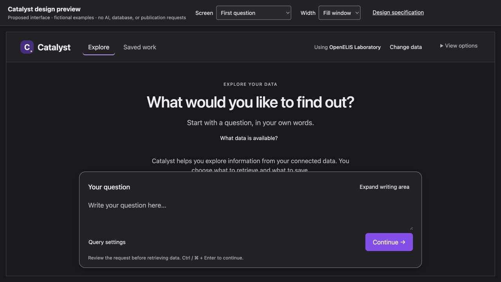

# Approved preview publication check — 10 September 2026

The first publication in harness #113 selected the obsolete Dashboard Builder
template. It rendered unresolved placeholders because its companion runtime was
missing. The earlier file-hash and HTTP checks compared against the wrong source
and did not verify the approved design. The screenshot comparison exposed this.

Harness [#114](https://github.com/pmanko/clinical-ai-validation-harness/pull/114)
replaced it with the complete approved staff Workbench preview. GitHub Pages
[deployment](https://github.com/pmanko/clinical-ai-validation-harness/actions/runs/34450142437)
succeeded for merged revision `89a03cf12a849f0b8424954da8e234d368b28b2f`.

The local server on port 18445 serves the six assets from
`docs/specs/staff-workbench-ux/`; they match the merged Catalyst source at
`c181b6b7cddb64949068e497b5f18d5e8da60a04`. The public bundle contains all six
assets. Its wrapper changes only the specification link to a pinned GitHub URL,
which returned HTTP 200. The `revision=final` parameter does not select a
different design: the preview wrapper does not read it.

Both screenshots below were captured and visually inspected in the same browser
tab at 1280 × 720, with the first-question screen and dark appearance. They show
the approved Explore/Saved work navigation, neutral charcoal surfaces, violet
primary action, View options, and resizable question-writing area. No unresolved
template placeholders appear. The public frame completed loading before capture.

| Approved local preview | Deployed public preview |
| --- | --- |
|  |  |

[Open the public mock](https://pmanko.github.io/clinical-ai-validation-harness/catalyst-design/).
The Results selector was also exercised in the built preview and displayed the
result summary and follow-up composer. The public preview remains illustrative;
this check does not establish product or Dashboard functionality acceptance.

Catalyst [#84](https://github.com/DIGI-UW/catalyst-ai/pull/84) removes the three
obsolete HTML pages, their runtime and their server script. The written binding
design records the retained requirements, and current pointers identify only the
approved mock as the visual reference. Prior material is recoverable in Git.

Validation performed: complete Pages build, five status model tests, eighteen
renderer/documentation tests, focused edited-document link checks, source-asset
comparison, staged diff checks, and the local/public screenshots above.
